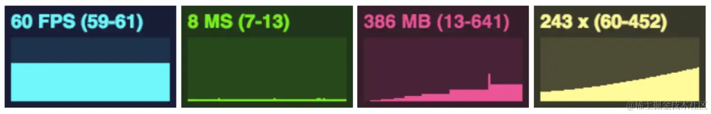

Three.js 是一个功能强大的 3D 引擎，用于创建 WebGL 应用。尽管它功能强大，但在复杂的 3D 场景中保持高性能是一个挑战。本文将分享一些在使用 Three.js 时的性能优化提示，帮助你提高应用的运行效率。

1. 使用 `stats.js` 监视性能

---

在进行任何优化之前，首先要监视应用的性能。`stats.js` 是一个简单而有效的工具，可以帮助你实时监视帧率（FPS）、每帧渲染所需时间（MS）和内存使用情况（MB）。

然后，可以在 Three.js 项目中使用它：

```
import Stats from 'three/examples/jsm/libs/stats.module.js';

const stats = new Stats();
stats.showPanel(0); // 显示面板 0: fps, 1: ms, 2: mb, 3+: custom
document.body.appendChild(stats.dom);

const tick = () => {
  stats.begin();
  // 监视的代码放在这里 或者可以使用stats.update()
  stats.end();
  requestAnimationFrame(tick);
};

requestAnimationFrame(tick);


```

**FPS**：在最后一秒内渲染的帧数。数值越高越好。

**MS**：渲染一帧所需的毫秒数。数值越低越好。

**MB**：分配的内存大小（以兆字节为单位）。需要在 Chrome 中使用 `--enable-precise-memory-info` 启动。

**CUSTOM**：用户自定义面板支持。



2. 优化几何体和材质

---

复杂的几何体和高分辨率的材质会显著影响渲染性能。以下是一些优化建议：

**降低几何体细节**

使用 `THREE.LOD`（Level of Detail）类来根据摄像机距离动态切换几何体细节。

```
import * as THREE from 'three';

// 创建场景和相机
const scene = new THREE.Scene();
const camera = new THREE.PerspectiveCamera(75, window.innerWidth / window.innerHeight, 0.1, 1000);
camera.position.z = 10;

// 创建渲染器
const renderer = new THREE.WebGLRenderer({
  antialias: true,
  powerPreference: 'high-performance'
});
renderer.setSize(window.innerWidth, window.innerHeight);
renderer.setPixelRatio(Math.min(window.devicePixelRatio, 2));
document.body.appendChild(renderer.domElement);

// 创建不同细节级别的几何体
const highDetailGeometry = new THREE.BoxGeometry(1, 1, 1, 32, 32, 32);
const mediumDetailGeometry = new THREE.BoxGeometry(1, 1, 1, 16, 16, 16);
const lowDetailGeometry = new THREE.BoxGeometry(1, 1, 1, 8, 8, 8);

const material = new THREE.MeshBasicMaterial({ color: 0x00ff00 });

// 使用 LOD 动态切换几何体
const lod = new THREE.LOD();
lod.addLevel(new THREE.Mesh(highDetailGeometry, material), 0);
lod.addLevel(new THREE.Mesh(mediumDetailGeometry, material), 5);
lod.addLevel(new THREE.Mesh(lowDetailGeometry, material), 10);
scene.add(lod);

// 动画循环
const animate = function () {
  requestAnimationFrame(animate);

  // 旋转 LOD
  lod.rotation.x += 0.01;
  lod.rotation.y += 0.01;

  // 更新摄像机位置
  camera.position.x = Math.sin(Date.now() * 0.001) * 20;
  camera.position.z = Math.cos(Date.now() * 0.001) * 20;
  camera.lookAt(scene.position);

  // 渲染场景和相机
  renderer.render(scene, camera);
};

animate();


```

**使用压缩纹理**

使用压缩纹理格式（如 DDS、KTX2）来减少内存占用和加载时间。这里以 `KTX2` 为例。

首先，安装 `three/examples/jsm/loaders/KTX2Loader.js` 和 `Basisu` 解码器，然后，在你的项目中使用 `KTX2Loader` 加载压缩纹理：

```
import { KTX2Loader } from 'three/examples/jsm/loaders/KTX2Loader.js';
import { MeshStandardMaterial } from 'three';

// 创建 KTX2Loader
const ktx2Loader = new KTX2Loader()
  .setTranscoderPath('path/to/basisu/transcoder/') // 设置 Basisu 解码器路径
  .detectSupport(renderer);

// 加载 KTX2 压缩纹理
ktx2Loader.load('path/to/texture.ktx2', (texture) => {
  const material = new MeshStandardMaterial({ map: texture });

  const geometry = new THREE.BoxGeometry(1, 1, 1);
  const mesh = new THREE.Mesh(geometry, material);
  scene.add(mesh);
});


```

**合并几何体**

将多个几何体合并为一个几何体，以减少绘制调用（draw call）的次数。使用 `BufferGeometryUtils` 合并几何体。

```
import { BufferGeometryUtils } from 'three/examples/jsm/utils/BufferGeometryUtils.js';

// 创建多个几何体
const geometries = [];
for (let i = 0; i < 50; i++) {
  const geometry = new THREE.BoxGeometry(0.5, 0.5, 0.5);

  geometry.translate(
    (Math.random() - 0.5) * 10,
    (Math.random() - 0.5) * 10,
    (Math.random() - 0.5) * 10
  );

  geometries.push(geometry);
}

// 合并几何体
const mergedGeometry = BufferGeometryUtils.mergeBufferGeometries(geometries);
const material = new THREE.MeshBasicMaterial({ color: 0x00ff00 });
const mesh = new THREE.Mesh(mergedGeometry, material);
scene.add(mesh);

// 动画循环
const animate = function () {
  requestAnimationFrame(animate);

  // 旋转合并后的几何体
  mesh.rotation.x += 0.01;
  mesh.rotation.y += 0.01;

  // 渲染场景和相机
  renderer.render(scene, camera);
};

animate();


```

3. 优化灯光和阴影

---

灯光和阴影计算开销较大，特别是多光源和动态阴影。以下是一些优化建议：

* **减少光源数量**：尽量减少场景中的光源数量，选择性能开销较小的光源如 AmbientLight 和 DirectionalLight。
* **优化阴影贴图**：降低阴影贴图的分辨率，并限制阴影相机的视野范围，以减少计算开销。

```
// 优化阴影贴图
directionalLight.shadow.mapSize.width = 1024; // 默认值是 512
directionalLight.shadow.mapSize.height = 1024; // 默认值是 512

// 限制阴影相机的视野范围
directionalLight.shadow.camera.top = 3;
directionalLight.shadow.camera.right = 6;
directionalLight.shadow.camera.left = -6;
directionalLight.shadow.camera.bottom = -3;
directionalLight.shadow.camera.near = 0.1;
directionalLight.shadow.camera.far = 10;

// 可选：使用相机助手查看阴影相机的范围
const cameraHelper = new THREE.CameraHelper(directionalLight.shadow.camera);
scene.add(cameraHelper);


```

* **静态光照贴图**：对于静态场景，可以预先计算光照和阴影，生成光照贴图。这里我们使用 `Lightmap`，一个 Three.js 的扩展，可以帮助实现静态光照贴图。

首先，安装 `three-lightmap`：

```
npm install three-lightmap


```

然后，在你的项目中使用 `three-lightmap` 来生成静态光照贴图：

```
import { Lightmap } from 'three-lightmap';

// 创建静态光照贴图
const lightmap = new Lightmap(scene, renderer, {
  mapSize: 1024,
  samples: 4,
  bake: true,
  exposure: 0.7,
  softEdges: 0.01,
  aoOnly: false,
  aoStrength: 0.6
});

// 在几何体上启用静态光照贴图
cube.material.lightMap = lightmap.generate(cube.geometry);
plane.material.lightMap = lightmap.generate(plane.geometry);

// 运行一次性光照贴图烘焙过程
lightmap.bake();


```

4. 纹理贴图

---

纹理贴图非常消耗 GPU 内存，以下是一些优化建议：

* **调整尺寸**：调整纹理贴图的分辨率可以通过图像编辑工具（如 Photoshop、GIMP）或编程工具（如 Sharp for Node.js）来实现。在加载纹理时，可以使用 Three.js 内置的 `THREE.TextureLoader` 来加载已经调整好尺寸的纹理。
* **使用正确格式**：确保使用合适的文件格式（如 .jpg 或 .png）。可以使用在线工具如 [TinyPNG](https://link.zhihu.com/?target=https%3A//link.juejin.cn/%3Ftarget%3Dhttps%253A%252F%252Ftinypng.com%252F) 来压缩纹理文件，减小文件大小，同时保持较高的视觉质量。
* **保持分辨率为 2 的幂次方**：确保纹理尺寸为 2 的幂次方（如 256x256, 512x512, 1024x1024）。如果纹理的尺寸不是 2 的幂次方，Three.js 会自动调整它们，但这会影响性能。

5. 使用对象池

---

在动画或游戏应用中，经常需要频繁创建和销毁对象。使用对象池可以有效减少内存分配和垃圾回收频繁的开销。

```
class ObjectPool {
  constructor(createFunc, size) {
    this.createFunc = createFunc;
    this.pool = [];
    for (let i = 0; i < size; i++) {
      this.pool.push(this.createFunc());
    }
  }

  get() {
    return this.pool.length ? this.pool.pop() : this.createFunc();
  }

  release(obj) {
    this.pool.push(obj);
  }
}


```

6. 渲染器优化

---

以下是一些针对渲染器的优化建议：

* **限制像素比**：一些设备有非常高的像素比，但渲染的像素越多，消耗的性能越大。将渲染器的像素比限制为 2：renderer.setPixelRatio(Math.min(window.devicePixelRatio, 2));
* **配置偏好**：指定 `powerPreference` 属性来提示用户代理适当的 GPU 配置：const renderer = new THREE.WebGLRenderer({powerPreference: 'high-performance'});
* **抗锯齿**：只有在有明显锯齿且不会显著影响性能时才启用抗锯齿。
  / 创建渲染器时启用抗锯齿
  const renderer = new THREE.WebGLRenderer({
  canvas: document.querySelector('#canvas'),
  antialias: true, // 启用抗锯齿
  powerPreference: 'high-performance' // 提示浏览器选择高性能的 GPU
  });

7. 相机优化

---

通过缩小相机的视野范围（FOV）以及调整相机的 `near` 和 `far` 属性，可以显著减少渲染的对象数量，从而提高渲染性能。下面是具体的实现代码和逻辑说明。

**缩小相机的视野范围**

通过减少相机的视野角度（FOV），可以让屏幕中显示的对象更少，从而减少需要渲染的三角形数量。

**调整相机的近端面和远端面**

调整相机的 `near` 和 `far` 属性，可以确保只渲染特定范围内的对象，避免渲染不必要的远距离对象。

```
// 调整相机的视野角度和近端面、远端面
const fov = 50; // 缩小视野角度（默认值通常为75）
const aspect = window.innerWidth / window.innerHeight;
const near = 1; // 将 near 属性从 0.1 增大到 1
const far = 50; // 将 far 属性从 100 缩小到 50
const camera = new THREE.PerspectiveCamera(fov, aspect, near, far);
camera.position.z = 10;


```

8. 清除不必要的对象

---

当场景中不再需要某个对象时，及时清除它：

```
// 创建示例对象
const geometry = new THREE.BoxGeometry();
const material = new THREE.MeshBasicMaterial({ color: 0x00ff00 });
const cube = new THREE.Mesh(geometry, material);
scene.add(cube);

// 在某个时刻移除对象
function removeObject(object) {
  // 移除对象
  scene.remove(object);
  // 释放几何体资源
  if (object.geometry) {
    object.geometry.dispose();
  }
  // 释放材质资源
  if (object.material) {
    if (Array.isArray(object.material)) {
      // 如果材质是数组，遍历并释放每个材质
      object.material.forEach((material) => {
        material.dispose();
      });
    } else {
      // 单一材质，直接释放
      object.material.dispose();
    }
  }
  // 释放纹理资源
  if (object.material.map) {
    object.material.map.dispose();
  }
}
// 在某个时刻调用函数移除对象
removeObject(cube);


```

9. 后期处理和着色器优化

---

**限制后期处理通道**

每个后期处理过程都会增加渲染负担，尽量减少不必要的后期处理步骤。

**着色器优化**

* **指定精度**：强制材质中着色器的精度：js复制代码 const shaderMaterial = new THREE.ShaderMaterial({precision: 'lowp'});
* **保持代码简单**：尽量保持着色器代码简单，避免复杂的逻辑和多层嵌套。
* **使用贴图纹理**：尽量使用纹理来代替复杂的计算，例如噪声生成。
* **使用 defines**：对于不会改变的值，使用 `defines` 而不是 `uniform`：
  js 复制代码 const shaderMaterial = new THREE.ShaderMaterial({
  defines: {uDisplacementStrength: 1.5},
  });

性能优化是一个持续的过程，需要根据具体的应用场景进行调整。以上提示可以帮助你在使用 Three.js 构建 3D 应用时提高性能。希望本文对你有所帮助！
