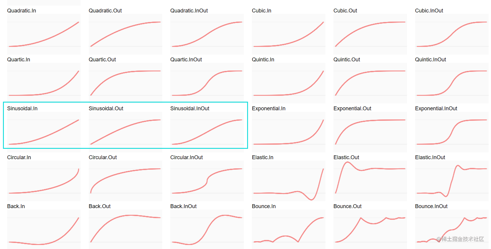

Tween.js 官网文档：[tween.js user guide | tween.js (tweenjs.github.io)](https://tweenjs.github.io/tween.js/docs/user_guide.html)

Tween.js 基本使用
-----------------

### 1. 引入 Tween.js

```
import TWEEN from "./tween.js-master/dist/tween.esm.js"

```

### 2. 定义基本 Tween 动画

**目的**：将 model 模型的位置，从原来的 (0,0,0) 位置，经过 1s 移动到 (20,50,30) 的位置。

模式一：

```
// 1 设置动画
const action=new TWEEN.Tween({x:0,y:0,z:0}) // 初始值
    .to({x:20,y:50,z:30},1000) // 目标值，毫秒数
    // 在动画执行期，不断被调用。其中obj为"to"里面的内容
    .onUpdate(function(obj){ 
        model.position.x=obj.x; // x:20
        model.position.y=obj.y;
        model.position.z=obj.z;
    })
    .start()

// 2 启动动画
function loop(){
    // 更新动画
    TWEEN.update() 
    requestAnimationFrame(render);
}

```

模式二：

```
const action=new TWEEN.Tween(model.position) // 初始值：模型的初始位置
    .to({x:20,y:50,z:30},1000) // 目标值，毫秒数
    .start()

```

### 3 字段说明

const action=new TWEEN.Tween(需添加动画的属性)

|    字段    |                       含义                       |                    示例                    |                                                                备注                                                                |
| :--------: | :----------------------------------------------: | :----------------------------------------: | :--------------------------------------------------------------------------------------------------------------------------------: |
|   start   |                     执行动画                     |   action.start()<br />action.start(num)   |                                             .start(毫秒数)：延迟 `n毫秒`之后运行动画                                             |
|    stop    |                     停止动画                     |               action.stop( )               |                                                   停止的动画必须为正在运行的动画                                                   |
|   chain   |                   链式执行动画                   |           actA.chain(actB,actC)           | 当 `actA`动画执行完后,立即执行 `actB`和 `actC`动画，其中B和C同时被执行。2. 前提:actA.start( ), actB和actC不需要开启.start( ) |
|   repeat   |                   重复执行动画                   | action.repeat(num) action.repeat(Infinity) |                                              num 重复执行的次数 2. Infinity 无限循环                                              |
|    yoyo    | 重复执行时是否衔接（起始值-结束值-起始值）溜溜球 |             action.yoyo(true)             |                                                 只有在 `repeat( )`独立使用时有效                                                 |
|   delay   |                   延迟执行动画                   |             action.delay(num)             |                         `action.delay(1000).start( )` 延迟1000毫秒后执行动画,`delay`在 `start`之前                         |
|     to     |    控制动画结束时的目标值+动画持续时间(毫秒)    |           action.to(object,num)           |                                                                                                                                    |
|   easing   |                     缓动动画                     | TWEEN.Easing.`easing函数`.`easing类型` |                     `easing函数`:算法->运动效果 `easing函数`:算法起作用的地方 `In`、`Out`、`InOut`                     |
|  onUpdate  |             在动画播放时，一直被调用             |             onUpdate(function)             |                                         function(obj){ } 形参obj指目标值(to( )的第1个参数)                                         |
|  onStart  |             动画开始播放时被调用一次             |             onStart(function)             |                                                                                                                                    |
| onComplete |               动画结束时被调用一次               |            onComplete(function)            |                                                                                                                                    |

警告：调用 `actA.chain（actB）` 实际上修改了 actA，所以 `chain` 的返回值只是 actA，不是一个新的 tween。

警告：`yoyo(true)` 只有在 `repeat(Infinity||200)`单独使用时有效

### 4 easing 缓动动画

地址：/tween.js-master/examples/03_graphs.html [官方网址 · GitHub](https://github.com/tweenjs/tween.js/blob/master/examples/03_graphs.html)



```
// 动画开始缓动-类比加速器
action.easing(TWEEN.Easing.Sinusoidal.In);
// 动画结束时缓动-类比减速刹车
action.easing(TWEEN.Easing.Sinusoidal.Out);
// 同时设置In和Out
action.easing(TWEEN.Easing.Sinusoidal.InOut);
```

### 5 例：相机旋转 + 模型淡入淡出动画

**目的：**

1. 当镜头移动时，镜头始终对准 model 模型，模型呈现淡入的效果
2. 当移动返回时，镜头始终对准 model 模型，模型呈现淡出的效果

镜头移动动画：

```
const cameraAct=new TWEEN.Tween(camera.position)
    .to({x:-100},3000)
    // 相机移动时，焦点始终为模型的位置
    .onUpdate(function(){
        camera.lookAt(model.position)
    })
    .start()

```

模型淡入动画：

```
const meshActIn = new TWEEN.Tween({ opacity: 0.0 })
    .to({ opacity: 1.0 }, 3000)
    // 动画开始：开启材质的透明度
    .onStart(function () {
        mat.transparent = true;
    })
    .onUpdate(function (obj) {
        mat.opacity = obj.opacity;
    })
    // 动画结束：关闭材质的透明度
    .onComplete(function () {
        mat.transparent = false;
    })
    .start();

```

模型淡出动画：

```
const meshActOut =new TWEEN.Tween({opacity:mat.opacity})
    .to({opacity:0.0}, 3000)
    // 动画开始：允许透明opacity属性才能生效
    .onStart(function(){
        material.transparent = true;
    })
    .onUpdate(function(obj){
        material.opacity = obj.opacity
    })
    .start();


```

### 备注

1. 材质需开启 `transparent`，才能设置透明程度 `opacity`

   ```
   const mat = new THREE.MeshLambertMaterial({
       color: 0x00ffff,
       transparent: true,
       opacity: 0.8,
   });

   ```
2. 调用 `actA.chain（actB）` 实际上修改了 actA，所以 `chain` 的返回值只是 actA，不是一个新的 tween。
3. `yoyo(true)` 只有在 `repeat(Infinity||200)`单独使用时有效
