#### 文章目录

* [一. 安装 wsl](#wsl_1)
* [二. 下载 docker desktop](#docker_desktop_41)
* [三. 更换 Docker 镜像](#Docker_63)
* [引用出处](#_108)

## 一. 安装 wsl

在安装 wsl 之前，先在 Windows 中配置 WSL 环境, 步骤很简单，按照以下文章进行

[Windows10/11 配置 WSL(Ubuntu) 环境](https://www.cnblogs.com/sillyfox/p/18063972)

> 以管理员身份打开 Windows PowerShell，执行以下命令

**执行该命令必须是 Windows10 2004 及更高版本**

```
wsl --install

```

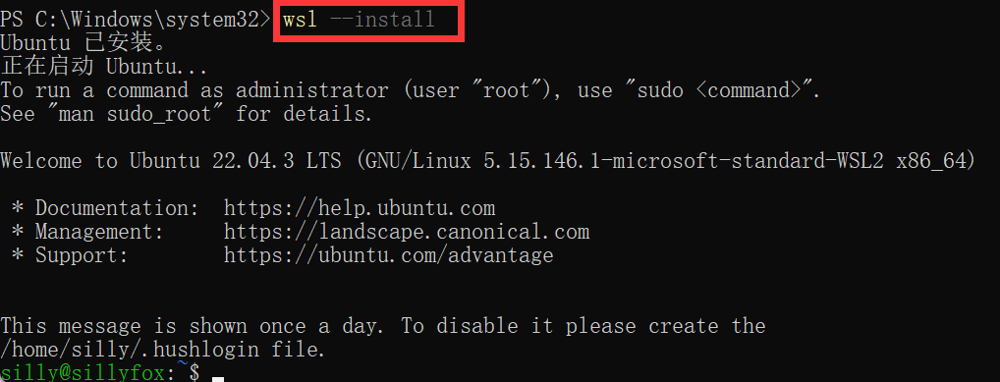

> 查看 WSL 是否安装正确

```

wsl.exe --list --verbose

```

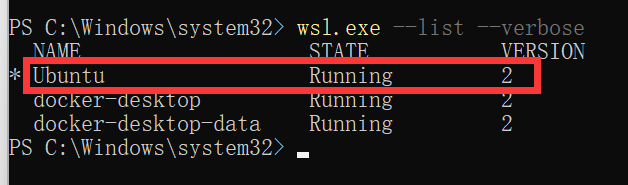

> 如果 wsl 启动报错，请按以下方式解决

报错截图：

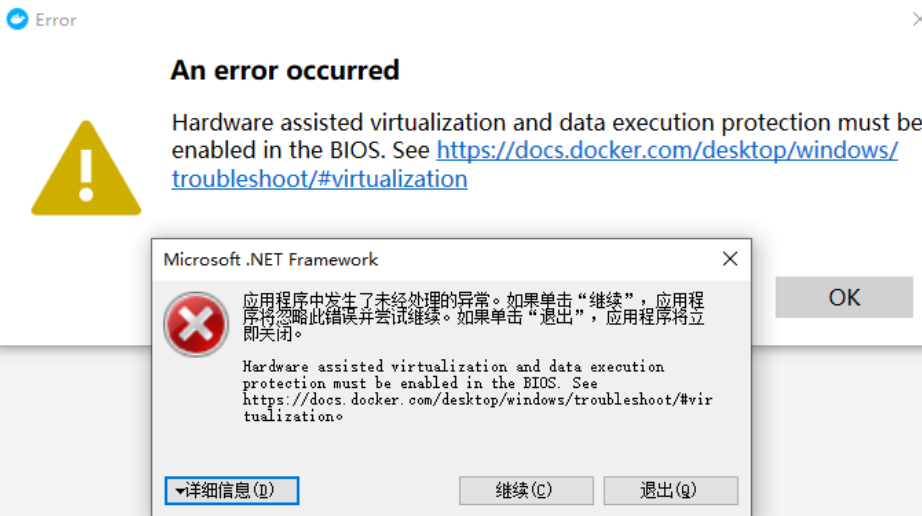

**解决方式**：控制面板 -> 程序 -> 启用或关闭 windows 功能，开启 Windows 虚拟化和 Linux 子系统（[WSL2](https://so.csdn.net/so/search?q=WSL2&spm=1001.2101.3001.7020))

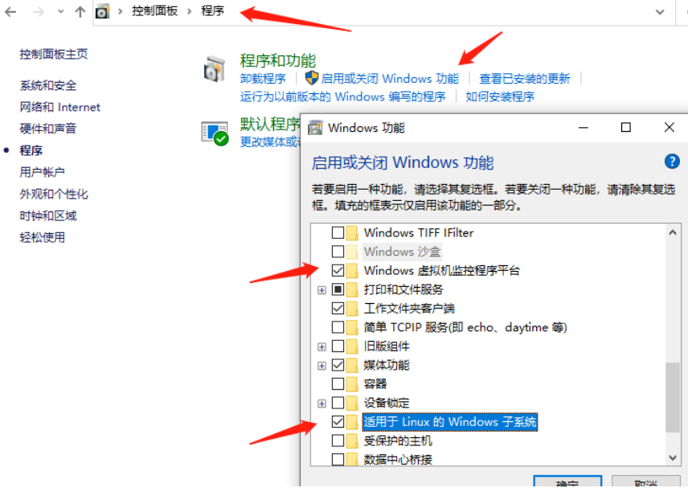

> 打开任务管理器，检查 BIOS 是否开启虚拟化

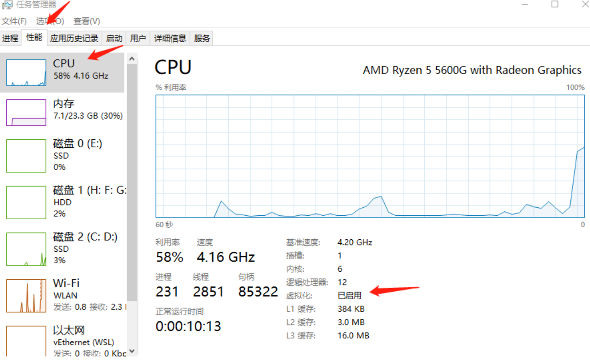

**如果是已禁用，请在开机时按 F2 进入 BIOS 开启一下，不会设置的可以网上搜索下自己主板的设置方法，Intel 和 AMD 的设置可能稍有不同**

## 二. 下载 docker desktop

[官网地址](https://docs.docker.com/desktop/install/windows-install/)

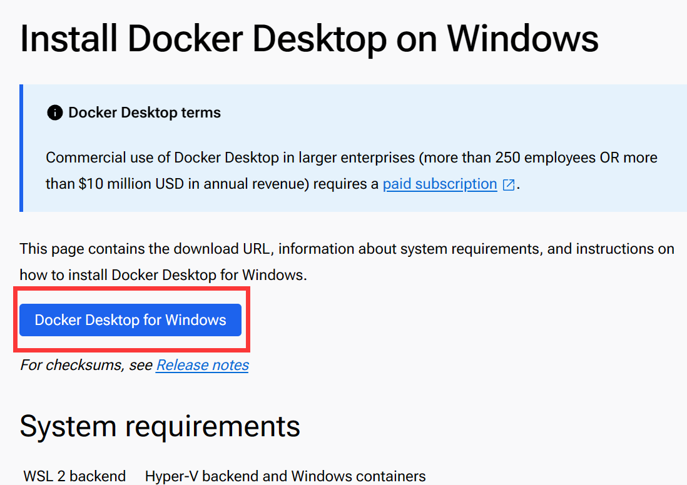

* 下载之后双击打开安装包


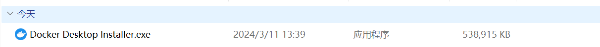

* 安装完成之后重启电脑，再次打开 Docker Desktop


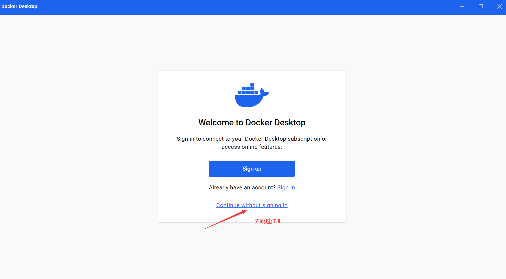

* 出现以下界面则表示安装成功

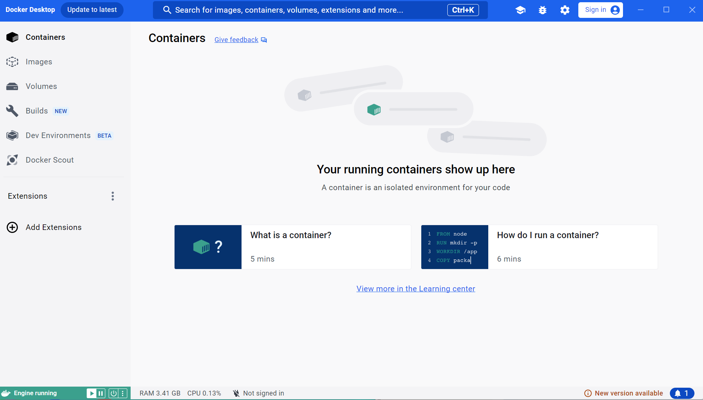

## 三. 更换 Docker 镜像

如果直接使用 Docker, 镜像会从官网直接进行拉取，网络会比较慢，因此需要更换镜像源

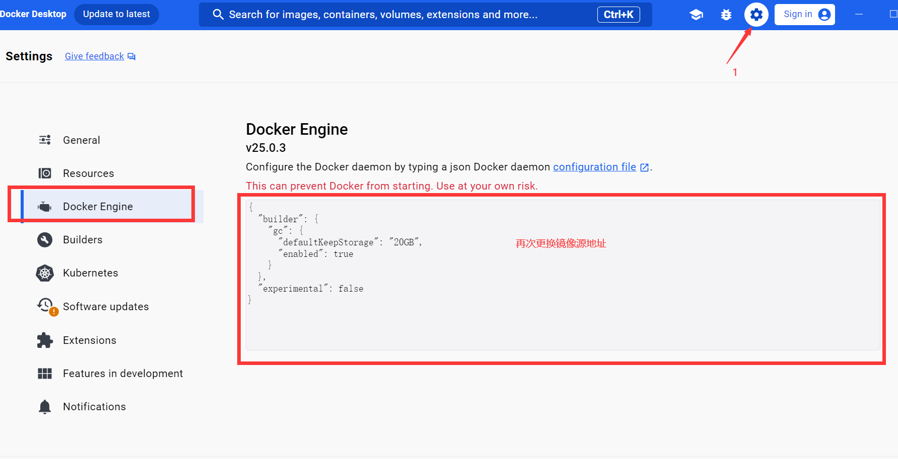

以下为我的代码示例，在 registry-mirrors 中添加镜像加速地址，可以添加多个，注意用逗号隔开

```

{"registry-mirrors":[
  "https://registry.docker-cn.com",
  "https://docker.mirrors.ustc.edu.cn",
  "https://hub-mirror.c.163.com"
],

  "builder": {
    "gc": {
      "defaultKeepStorage": "20GB",
      "enabled": true
    }
  },
  "experimental": false
}

```

> 镜像加速源总结

**`<table>`**`<thead>`**`<tr>`**`<th>`镜像加速器**`</th>`**`<th>`镜像加速器地址**`</th>`**`</tr>`**`</thead>`**`<tbody>`**`<tr>`**`<td>`Docker 中国官方镜像**`</td>`**`<td>`[https://registry.docker-cn.com](https://registry.docker-cn.com)`</td>`**`</tr>`**`<tr>`**`<td>`**DaoCloud 镜像站**`</td>`**`<td>`[http://f1361db2.m.daocloud.io](http://f1361db2.m.daocloud.io)`</td>`**`</tr>`**`<tr>`**`<td>`**Azure 中国镜像**`</td>`**`<td>`[https://dockerhub.azk8s.cn](https://dockerhub.azk8s.cn)`</td>`**`</tr>`**`<tr>`**`<td>`**科大镜像站**`</td>`**`<td>`[https://docker.mirrors.ustc.edu.cn](https://docker.mirrors.ustc.edu.cn)`</td>`**`</tr>`**`<tr>`**`<td>`**阿里云**`</td>`**`<td>`[https://ud6340vz.mirror.aliyuncs.com](https://ud6340vz.mirror.aliyuncs.com)`</td>`**`</tr>`**`<tr>`**`<td>`**七牛云**`</td>`**`<td>`[https://reg-mirror.qiniu.com](https://reg-mirror.qiniu.com)`</td>`**`</tr>`**`<tr>`**`<td>`**网易云**`</td>`**`<td>`[https://hub-mirror.c.163.com](https://hub-mirror.c.163.com)`</td>`**`</tr>`**`<tr>`**`<td>`**腾讯云**`</td>`**`<td>`[https://mirror.ccs.tencentyun.com](https://mirror.ccs.tencentyun.com)`</td>`**`</tr>`**`</tbody>`**`</table>`**

> 修改完代码之后点击应用和重启选项

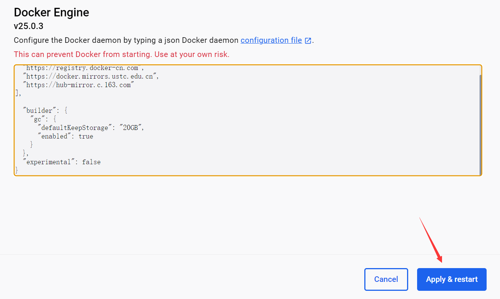

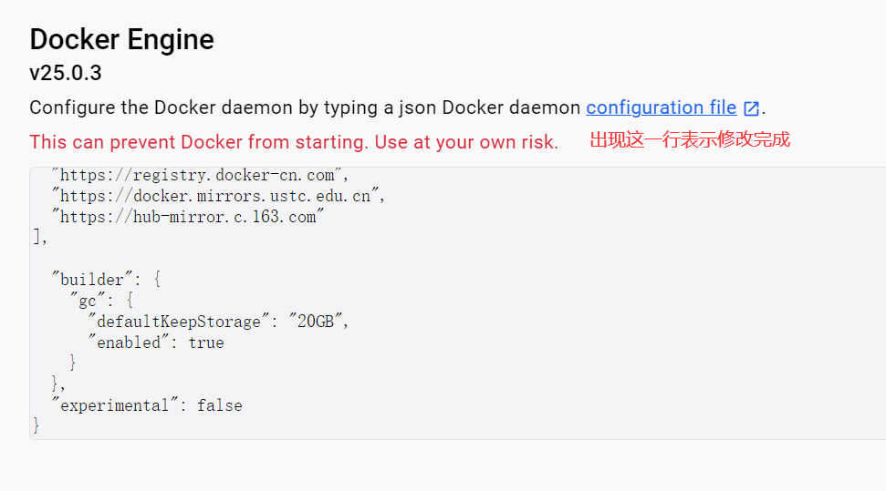

## 引最新镜像源

目前可用国内镜像源"https://docker.rainbond.cc"
其他国内大厂镜像源都被限制了  暂时无法使用  ——2024-11-15
