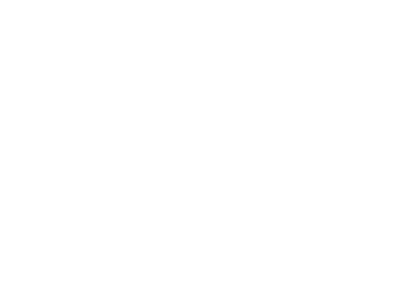
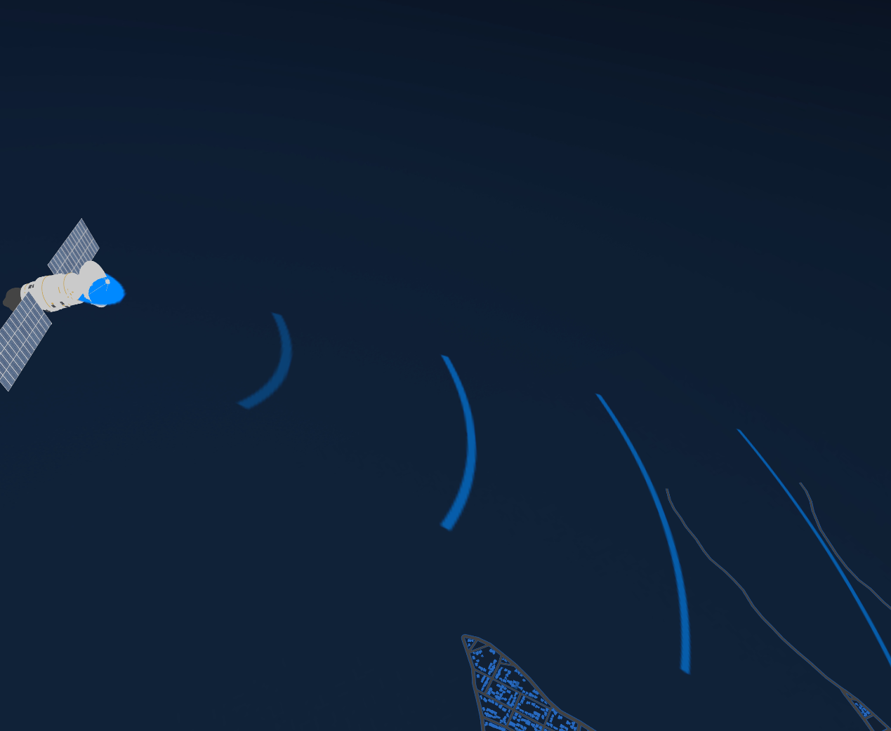

# threejs信号波动效果

1. **创建信号波动网格：** 使用 `THREE.PlaneGeometry`创建一个平面几何形状，然后通过旋转和平移将其放置在合适的位置和方向。
2. **设置材质和纹理：** 创建 `THREE.MeshLambertMaterial`材质实例，加载信号波纹理，并设置材质的透明度和双面显示属性。

   signalWave

   
3. **动态更新网格规模：** 在动画函数中，通过改变网格的缩放值来模拟波动效果。这可以通过 `updateSignalMesh`函数实现，该函数根据预设的波动范围和周期调整网格的透明度和规模。
4. **动画控制：** 使用 `requestAnimationFrame`创建动画循环，调用 `updateSignalMesh`函数更新信号波动网格的动态效果。

```js
/**
 * 创建一个信号网格
 *
 * @returns 返回一个THREE.Mesh类型的信号网格对象
 */
export function createSignalMesh() {
    let texLoad = new THREE.TextureLoader();
    let L = 0.15;
    let geometry = new THREE.PlaneGeometry(L, 0.6 * L);
    geometry.translate(-L / 2, 0, 0);
    geometry.rotateX(-Math.PI / 180 * 55);
    geometry.rotateY(Math.PI / 180 * 45);
    geometry.rotateZ(Math.PI / 180 * 45);
    window.geometry = geometry
    let material = new THREE.MeshLambertMaterial({
      map: texLoad.load("/assets/three/textures/signalWave.png"),
    //   color: "#58E9B1", //设置颜色
      color: "#006eff", //设置颜色
      transparent: true, //允许透明计算
      side: THREE.DoubleSide,
      depthWrite: false,
    });

    let plane = new THREE.Mesh(geometry, material);
    // plane.rotateX(-Math.PI / 6);
    return plane;
}
let S = 600; //波动范围倍数设置
let _s = 1;
export function updateSignalMesh(plane) {
    // 波动动画
    _s += 10;
    plane.scale.set(_s, _s, _s);
    if (_s <= S * 0.2) {
      plane.material.opacity = 2 * (_s - 1) / (S * 0.2 - 1); //保证透明度在0~1之间变化
    } else if (_s > S * 0.2 && _s <= S) {
      plane.material.opacity = 2 - (_s - S * 0.2) / (S - S * 0.2); //保证透明度在0~1之间变化
    } else {
      _s = 1.0;
    }
}
```

 使用案例

```js
const signalMesh = createSignalMesh(20);
scene.add(signalMesh);

const clock = new THREE.Clock(); //计时器
const FPS = 60; // 指的是 30帧每秒的情况
const singleFrameTime = 1 / FPS;
let timeStamp = 0;
function animate() {
    window.loopId = requestAnimationFrame(animate);
    const delta = clock.getDelta(); //获取距离上次请求渲染的时间
    if (timeStamp > singleFrameTime) {
        renderer.render(scene, camera);
    	signalMesh && updateSignalMesh(signalMesh)
    // 剩余的时间合并进入下次的判断计算 这里使用取余数是因为 当页页面失去焦点又重新获得焦点的时候，delta数值会非常大， 这个时候就需要
    timeStamp = timeStamp % singleFrameTime;
    }
}
```

效果展示


