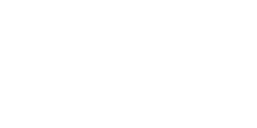
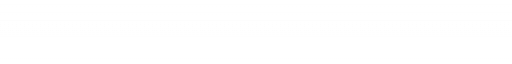
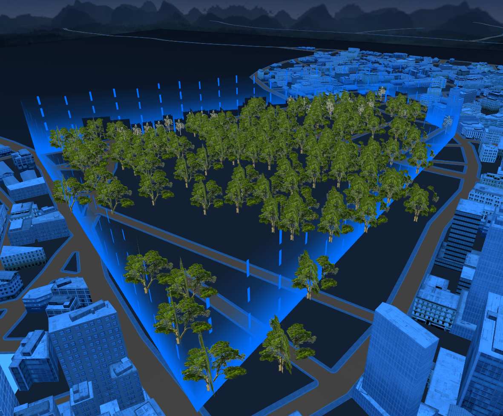

# threejs电子围栏效果

1. **创建围栏几何形状**：使用 `THREE.BufferGeometry`和顶点坐标数组来创建围栏的几何形状。
2. **纹理动画**：加载纹理并设置其重复方式，通过更新纹理的偏移量来实现流动效果。

   以下是所需的两张纹理贴图

   lightflow  linearGradient

   
3. **材质**：创建 `THREE.MeshBasicMaterial`实例，设置材质的透明度和深度写入属性。
4. **动态更新纹理偏移**:通过 `updateLightFlow`函数，我们可以在每一帧更新纹理的偏移量，从而实现动态流动的效果。

```js
let lightFlowTexture = new THREE.TextureLoader().load("./assets/three/textures/lightflow.png");
lightFlowTexture.wrapS = THREE.RepeatWrapping;
lightFlowTexture.wrapT = THREE.RepeatWrapping;
lightFlowTexture.repeat.set(10, 1); // 平铺
let linearGradientTexture = new THREE.TextureLoader().load("./assets/three/textures/linearGradient.png");
// 流动方向
let direction = 'top'

/**
 * 创建围栏
 *
 * @param points 围栏的顶点坐标数组
 * @param height 围栏的高度，默认为10
 * @param color 围栏的颜色，默认为'#58E9B1'
 * @param name 围栏的名称
 * @returns 创建的围栏对象
 */
export function createFence({ points, height = 10, color = '#58E9B1', name }) {
    // 围栏距离 累加
    const pointDistance = [];
    // 围栏总长度
    const distance = points.reduce((totalDistance, point, index) => {
        let segmentDistance = 0;
        if (index > 0) {
            let lastPoint = new THREE.Vector3(...points[index - 1]);
            let currPoint = new THREE.Vector3(...point);
            segmentDistance = lastPoint.distanceTo(currPoint);
        }
        totalDistance += segmentDistance;
        pointDistance.push(totalDistance);
        return totalDistance;
    }, 0);
    // 几何体
    const geometry = new THREE.BufferGeometry(); // 缓冲几何体
    const posArr = [];
    const uvArr = [];
    // 遍历坐标
    // posArr 几何体顶点
    points.forEach((point, index) => {
        if (index == 0) return;
        const lastPoint = points[index - 1];

        // 三角面1
        posArr.push(...lastPoint);
        uvArr.push(pointDistance[index - 1] / distance, 0);
        posArr.push(...point);
        uvArr.push(pointDistance[index] / distance, 0);
        posArr.push(lastPoint[0], lastPoint[1] + height, lastPoint[2]);
        uvArr.push(pointDistance[index - 1] / distance, 1);

        // 三角面2
        posArr.push(...point);
        uvArr.push(pointDistance[index] / distance, 0);
        posArr.push(point[0], point[1] + height, point[2]);
        uvArr.push(pointDistance[index] / distance, 1);
        posArr.push(lastPoint[0], lastPoint[1] + height, lastPoint[2]);
        uvArr.push(pointDistance[index - 1] / distance, 1);
    });
    console.log(posArr, uvArr);
    geometry.setAttribute(
        "position",
        new THREE.BufferAttribute(new Float32Array(posArr), 3)
    );
    geometry.setAttribute(
        "uv",
        new THREE.BufferAttribute(new Float32Array(uvArr), 2)
    );
    // 材质
    const material = new THREE.MeshBasicMaterial({
        color: color,
        map: lightFlowTexture,
        transparent: true,
        opacity: 1,
        depthWrite: false,
        // depthTest: false,
        side: THREE.DoubleSide,
    });
    // 创建围栏
    const fenceGroup  = new THREE.Group();
    fenceGroup.name = name;
    const lightFlowMesh = new THREE.Mesh(geometry, material);
    const linearGradientMesh = lightFlowMesh.clone();
    linearGradientMesh.material = new THREE.MeshBasicMaterial({
        color: color,
        map: linearGradientTexture,
        transparent: true,
        side: THREE.DoubleSide,
        opacity: 1,
        depthWrite: false,
        // depthTest: false,
    });
    fenceGroup.add(lightFlowMesh, linearGradientMesh);
    return fenceGroup;
}

/**
 * 更新围栏流动效果
 *
 * @param offset 偏移量
 * @returns 无返回值
 */
export function updateLightFlow(offset) {
    if(lightFlowTexture){
        const times = 1
        // offset *= times
        switch (direction) {
            case "left":
              lightFlowTexture.offset = new THREE.Vector2(offset, 0); //纹理偏移
              break;
            case "right":
              lightFlowTexture.offset.add(new THREE.Vector2(-offset, 0));
              break;
            case "top":
              lightFlowTexture.offset.add(new THREE.Vector2(0, -offset));
              break;
            case "left":
              lightFlowTexture.offset = new THREE.Vector2(0, offset);
              break;
          }
    }
}
```

 使用案例

```js
const fenceData = {
    points: [
      [-104.53453719603017, -0.000008159126132056826, 22.43529558834765],
      [-67.98523226546001, -0.000008159126132056826, -8.715910240401607],
      [52.77249939766944, -0.000008159126132056826, 163.05624148529716],
      [12.506657010292455, -0.000008159126132056826, 174.20373279368948],
      [-67.18970856238782, -0.000008159126120688143, 106.57684962534125],
      [-104.53453719603017, -0.000008159126132056826, 22.43529558834765],
    ],
    color: "#006eff",
    height: 15,
    name: "家庭守护",
  }

const fenceList = new THREE.Group();
scene.add(fenceList);
const fenceGroup = createFence(fenceData);


const clock = new THREE.Clock(); //计时器
const FPS = 60; // 指的是 30帧每秒的情况
const singleFrameTime = 1 / FPS;
let timeStamp = 0;
function animate() {
    window.loopId = requestAnimationFrame(animate);
    const delta = clock.getDelta(); //获取距离上次请求渲染的时间
    if (timeStamp > singleFrameTime) {
        renderer.render(scene, camera);
        updateLightFlow(delta);
      
    // 剩余的时间合并进入下次的判断计算 这里使用取余数是因为 当页页面失去焦点又重新获得焦点的时候，delta数值会非常大， 这个时候就需要
    timeStamp = timeStamp % singleFrameTime;
    }
}
```

效果展示


