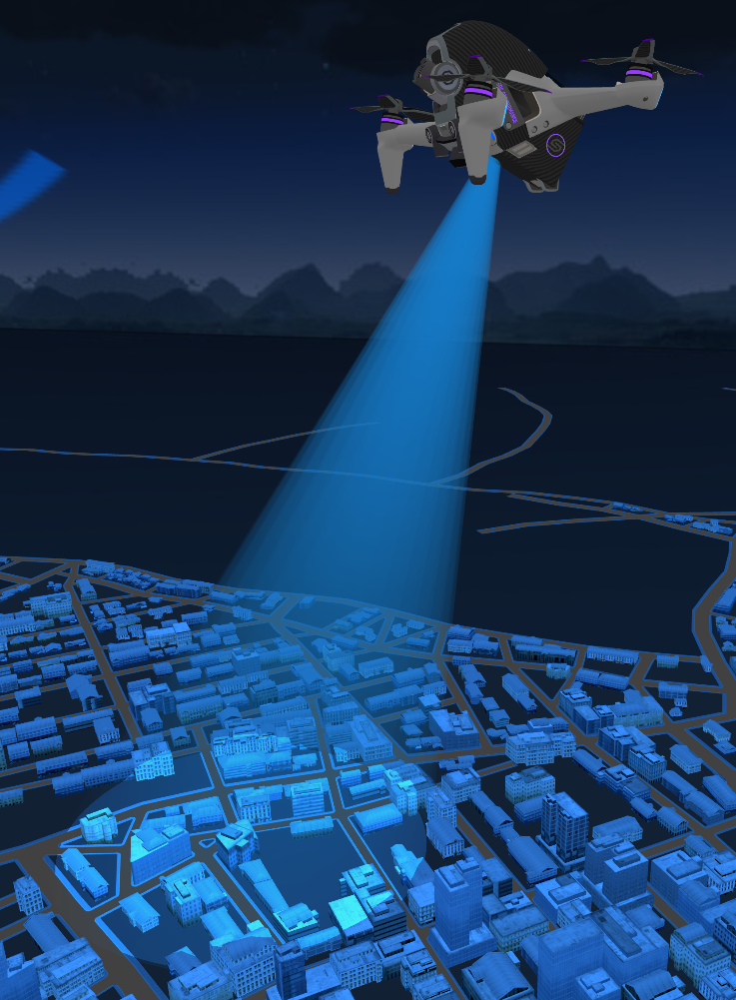

# threejs聚光灯效果

1. 首先使用 `THREE.ShaderMaterial` 创建一个自定义材质 ，定义了两个uniform变量 `beamColor` 和 `beamIntensity` 来控制光束的颜色和强度，通过调整透明度来模拟聚光灯光束颜色。
2. 其次使用 `THREE.CylinderGeometry` 创建一个圆柱体几何形状，表示聚光灯的光束部分。
3. 最后创建 `THREE.SpotLight`防止到上面聚光灯模型中，同时创建一个目标网格（`targetMesh`），用于定位聚光灯的焦点，实现灯光照射效果。

```js
/**
 * 创建一个聚光灯网格
 *
 * @param geometryAttr 几何体属性对象
 * @param geometryAttr.radiusTop 顶部半径
 * @param geometryAttr.radiusBottom 底部半径
 * @param geometryAttr.height 高度
 * @param geometryAttr.radialSegments 径向分段数
 * @param geometryAttr.heightSegments 高度分段数
 * @param geometryAttr.openEnded 是否开放端点
 * @param lightAttr 灯光属性对象
 * @param lightAttr.color 灯光颜色
 * @param lightAttr.intensity 灯光强度
 * @returns 聚光灯网格
 */
function createSpotLightMesh({
    geometryAttr,
    lightAttr
}) {
    const {radiusTop,radiusBottom,height,radialSegments,heightSegments,openEnded} = geometryAttr
    const {color,intensity} =lightAttr
  
    const material = new THREE.ShaderMaterial({
        vertexShader: `
            ${ THREE.ShaderChunk.logdepthbuf_pars_vertex } // 新增的
            bool isPerspectiveMatrix (mat4) { // 新增的
                return true; // 新增的
            } // 新增的
            varying vec2 vUv;
            varying vec3 viewDir;
            varying vec3 worldNormal;

            void main() {
                vUv = uv;
                vec4 worldPosition = modelMatrix * vec4(position, 1.0);
                vec4 viewPosition = viewMatrix * worldPosition;
                viewDir = normalize(viewPosition.xyz);
                worldNormal = normalize(normalMatrix * normal);
                gl_Position = projectionMatrix * modelViewMatrix * vec4(position, 1.0);
                ${ THREE.ShaderChunk.logdepthbuf_vertex } // 新增的
            }
        `,
        fragmentShader: `
            ${ THREE.ShaderChunk.logdepthbuf_pars_fragment } // 新增的
            varying vec3 viewDir;
            varying vec3 worldNormal;
            varying vec2 vUv;
            uniform vec3 beamColor;
            uniform float beamIntensity;
            void main() {
                vec3 beamEffect = beamColor * beamIntensity; // 根据需要调整光束的颜色和强度
  
                float dotProduct = abs(dot(viewDir, worldNormal));
  
                gl_FragColor = vec4(beamEffect, dotProduct);
                gl_FragColor = vec4(beamEffect, dotProduct * vUv.y);
                ${ THREE.ShaderChunk.logdepthbuf_fragment } // 新增的
            }
        `,
        side: THREE.DoubleSide,
        uniforms: {
            beamColor: { value: new THREE.Color(color) }, // 光束颜色
            beamIntensity: { value: intensity }, // 光束强度
        },
        transparent: true, // 如果需要透明效果，设置为true
        depthWrite: false,  // Disable depth writing
    });
  
    const geometry = new THREE.CylinderGeometry(radiusTop,radiusBottom,height,radialSegments,heightSegments,openEnded);
    // 计算圆柱体顶部中心的位置
    const topCenter = new THREE.Vector3(0, -height / 2, 0);
    // 将网格的旋转中心点设置为圆柱体顶部中心
    geometry.translate(topCenter.x, topCenter.y, topCenter.z);
    // const material = new THREE.MeshBasicMaterial({ color: color, transparent: true, opacity: 0.5,depthWrite:false });
    const mesh = new THREE.Mesh(geometry, material);
    const targetMesh = new THREE.Object3D();
    targetMesh.position.set(0, -height, 0);
    mesh.add(targetMesh);
    const spotLight = new THREE.SpotLight( color,100,0, Math.PI/180 * 13,0,0.3 );
    // 灯光将投射阴影 开启阴影
    spotLight.castShadow = true;
    spotLight.shadow.mapSize.width = 1024;
    spotLight.shadow.mapSize.height = 1024;
    spotLight.shadow.camera.near = 0;
    spotLight.shadow.camera.far = 300;
    spotLight.shadow.camera.fov = 20;
    spotLight.distance = 0
    spotLight.target = targetMesh
    mesh.add( spotLight );
    return mesh
}

// 使用案例
const spotLightMeshAttr = {
    geometryAttr: {
        radiusTop: 0,
        radiusBottom: 5,
        height: 20,
        radialSegments: 32,
        heightSegments: 1,
        openEnded: false,
    },
    lightAttr: {
        color: "#51b9e6",
        intensity: 1.0,
    },
};
const spotMesh = createSpotLightMesh(spotLightMeshAttr); 
scene.add(spotMesh)
```

效果展示

