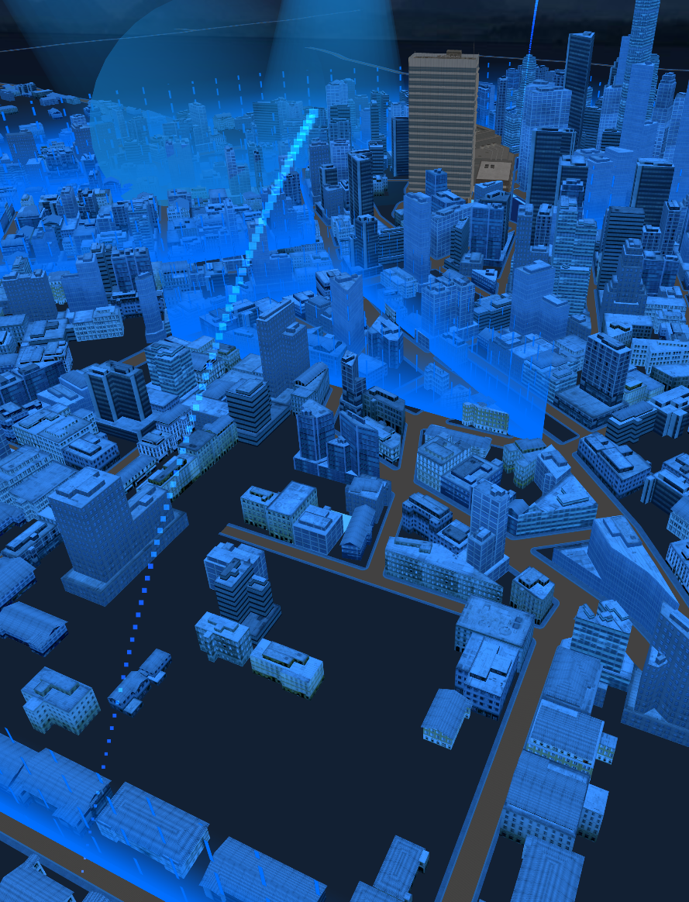

# threejs雷达扫描效果

在Three.js中，实现一个圆形扫描效果可以为场景增添一种科技感，常见于雷达扫描、数据可视化或特殊视觉效果的展示。本文将详细介绍如何使用Three.js和自定义着色器来创建这样的动态圆形扫描效果。

#### 创建圆形扫描效果的步骤

**1. 编写自定义片元着色器：**
自定义片元着色器中定义了 `atan2`函数来计算角度，以及根据时间和位置变化来调整像素的透明度，从而实现扫描效果。

**2. 定义着色器uniform变量：**
在着色器代码中定义了控制颜色、时间、透明度、半径和扫描线宽度的uniform变量。

**3. 创建平面几何体：**
使用 `THREE.PlaneGeometry`创建一个平面作为显示扫描效果的载体。

**4. 设置ShaderMaterial材质：**
创建 `THREE.ShaderMaterial`材质实例，传入自定义的顶点和片元着色器代码，并设置uniform变量。

**5. 创建Mesh网格：**
使用几何体和材质创建 `THREE.Mesh`网格，设置网格的位置和旋转，以适应动画需求。

**6. 动画效果实现：**
在动画循环中更新uniform变量 `time`的值，以实现随时间变化的扫描效果。

```js
import * as THREE from 'three';

const frag_basic = `
precision mediump float;
 
float atan2(float y, float x){
  float t0, t1, t2, t3, t4;
  t3 = abs(x);
  t1 = abs(y);
  t0 = max(t3, t1);
  t1 = min(t3, t1);
  t3 = float(1) / t0;
  t3 = t1 * t3;
  t4 = t3 * t3;
  t0 = -float(0.013480470);
  t0 = t0 * t4 + float(0.057477314);
  t0 = t0 * t4 - float(0.121239071);
  t0 = t0 * t4 + float(0.195635925);
  t0 = t0 * t4 - float(0.332994597);
  t0 = t0 * t4 + float(0.999995630);
  t3 = t0 * t3;
  t3 = (abs(y) > abs(x)) ? float(1.570796327) - t3 : t3;
  t3 = (x < 0.0) ?  float(3.141592654) - t3 : t3;
  t3 = (y < 0.0) ? -t3 : t3;
  return t3;
}
// 计算距离
float distanceTo(vec2 src, vec2 dst) {
	float dx = src.x - dst.x;
	float dy = src.y - dst.y;
	float dv = dx * dx + dy * dy;
	return sqrt(dv);
}

#define PI 3.14159265359
#define PI2 6.28318530718

uniform vec3 u_color;
uniform float time;
uniform float u_opacity;
uniform float u_radius;
uniform float u_width;
uniform float u_speed;

varying vec2 v_position;

    `
const Shader = {
    vertexShader: `
    varying vec2 v_position;
  
    void main() {
        v_position = vec2(position.x, position.y);
        gl_Position = projectionMatrix * modelViewMatrix * vec4(position, 1.0);
    }`,
    fragmentShader: `
    ${frag_basic} 
    void main() {
        float d_time = u_speed * time;

        float angle = atan2(v_position.x, v_position.y) + PI;
  
        float angleT = mod(angle + d_time, PI2);

        float width = u_width;
  
        float d_opacity = 0.0;

        // 当前位置离中心位置
        float length = distanceTo(vec2(0.0, 0.0), v_position);
  
        float bw = 5.0;
        if (length < u_radius && length > u_radius - bw) {
            float o = (length - (u_radius - bw)) / bw;
            d_opacity = sin(o * PI); 
        }

        if (length < u_radius - bw / 1.1) {
            d_opacity = 1.0 - angleT / PI * (PI / width);
        } 

        if (length > u_radius) { d_opacity = 0.0; }
 
        gl_FragColor = vec4(u_color, d_opacity * u_opacity);
    }`
}

/**
 * 创建一个THREE.Mesh对象
 *
 * @param opts 配置项
 * @param opts.radius 半径，默认为50
 * @param opts.color 颜色，默认为"#fff"
 * @param opts.speed 速度，默认为1
 * @param opts.opacity 透明度，默认为1
 * @param opts.angle 角度，默认为Math.PI
 * @param opts.position 位置，默认为{x: 0, y: 0, z: 0}
 * @param opts.rotation 旋转角度，默认为{x: -Math.PI / 2, y: 0, z: 0}
 * @returns 返回一个THREE.Mesh对象
 */
export default function (opts) {
    const {
        radius = 50,
        color = "#fff",
        speed = 1,
        opacity = 1,
        angle = Math.PI,
        position = {
            x: 0,
            y: 0,
            z: 0
        },
        rotation = {
            x: -Math.PI / 2,
            y: 0,
            z: 0
        }
    } = opts;

    const width = radius * 2;

    const geometry = new THREE.PlaneGeometry(width, width, 1, 1);

    const material = new THREE.ShaderMaterial({
        uniforms: {
            u_radius: {
                value: radius
            },
            u_speed: {
                value: speed
            },
            u_opacity: {
                value: opacity
            },
            u_width: {
                value: angle
            },
            u_color: {
                value: new THREE.Color(color)
            },
            time: {
                value: 0
            }
        },
        transparent: true,
        depthWrite: false,
        depthTest: false,
        side: THREE.DoubleSide,
        vertexShader: Shader.vertexShader,
        fragmentShader: Shader.fragmentShader,
    })

    const mesh = new THREE.Mesh(geometry, material);

    mesh.rotation.set(rotation.x, rotation.y, rotation.z);
    mesh.position.copy(position);

    return mesh
}
```

 使用案例

```js
import Radar from './radar.js'
let uTime = {
	value:0,
}
const radarData = {
    position: {
      x: 23,
      y: 10,
      z: 268,
    },
    radius: 20,
    color: "#ff0000",
    opacity: 0.5,
    speed: 2,
  };
const radarMesh = Radar(radarData);
radarMesh.material.uniforms.time = uTime;

const clock = new THREE.Clock(); //计时器
const FPS = 60; // 指的是 30帧每秒的情况
const singleFrameTime = 1 / FPS;
let timeStamp = 0;
function animate() {
    window.loopId = requestAnimationFrame(animate);
    const delta = clock.getDelta(); //获取距离上次请求渲染的时间
    uTime.value += delta;
    if (timeStamp > singleFrameTime) {
        renderer.render(scene, camera);
    // 剩余的时间合并进入下次的判断计算 这里使用取余数是因为 当页页面失去焦点又重新获得焦点的时候，delta数值会非常大， 这个时候就需要
    timeStamp = timeStamp % singleFrameTime;
    }
}
```

效果展示


