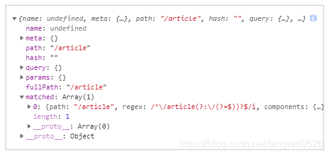

## 1 问题描述

页面加载时，需要判断：地址能否匹配上路由。如果匹配不上，就跳转到首页。

代码：

```js
mounted(){
	if (this.$route.matched.length === 0) {
		this.$router.push("/index");
	}
}
```

问题出现了：当访问的地址可以匹配上路由时，也会跳到首页。

---

## 2 找到问题

在 mounted 中打印 `$route`：


可以看到，所有的值都不对。最明显的是 `path` 和 `fullPath` ，明明应该有值，但现在只是一个 `"/"` 。

我猜测：在 mounted 中，router 的初始化还没有完成，所以取到的是一个初始默认值。

加一个延时，试一下：

```js
mounted(){
	setTimeout(() => {
		if (this.$route.matched.length === 0) {
			this.$router.push("/index");
		}
	},1000);
}
```

延时 1000ms ，此时router 的值是对的了：



- **vue-router 初始化是需要一段时间的，在完成之前，取值只能拿到初始的默认值。**
- **在 mounted 中 router 初始化可能还没有完成。**

---

## 3 不能用定时器，用 onReady

上面用定时器延迟了1000ms，取到了 router。但是，真正要解决这个问题，肯定不能用定时器，因为延迟的时间无法确定：

- 长了，影响体验
- 短了，可能router初始化还没完成呢

我去翻了官网API，希望官方提供了**初始化完成时的回调方法**，果然找到了：[onReady](https://router.vuejs.org/zh/api/#router-onready)

代码改成：

```js
mounted(){
	this.$router.onReady(() => {
		if (this.$route.matched.length === 0) {
			this.$router.push("/index");
		}
	});
}
```

完美通过！

---

## 4 有的同学可能会担心：onReady会不会错过啊？

（可能只有我担心这个问题）

### 4.1 “错过”是什么意思

先解释一下 “错过”。举个例子：

给 window 绑定 load 事件：

```html
<!DOCTYPE html>
<html>
<head>
	<script>
		window.onload = function() {
			alert("load")
		};
	</script>
</head>
<body></body>
</html>
```

会弹出：


如果延迟一会儿，再绑定事件呢：

```html
<!DOCTYPE html>
<html>
<head>
	<script>
		setTimeout(() => {
			window.onload = function() {
				alert("load")
			};
		}, 2000);
	</script>
</head>
<body></body>
</html>
```

这样就不会弹出了。因为延迟了2000ms 后才绑定事件。这个时候 window已经 load 完了。错过了。

### 4.2 onReady会不会"错过"呢？

先说结论：**不会！**

因为 window.onload 和 [vue](https://so.csdn.net/so/search?q=vue&spm=1001.2101.3001.7020)\-router 的 onReady 是完全不同的两种机制：

```js
// 机制一：绑定处理函数。绑定好之后，window触发load事件时，才会调用。所以存在错过的现象
window.onload = cb;

// 机制二：调用 onReady 函数！
router.onReady(cb); 
12345
```

去看看 [源码](https://github.com/vuejs/vue-router/blob/dev/src/history/base.js) ，onReady 到底是做了什么：


- 如果路由已经 ready 了，就立即执行 `cb`。
- 如果路由还没有 ready，就把 `cb` 放到 readyCbs 中。

接着看源码，发现：

上面这段代码是在初始化完成后立即调用的：修改 ready 为 true ，并执行 readyCbs 中的 cb 。

所以，onReady不会错过，放心的用！

## 注意:

在vue-router@4中

请将 `onReady` 改为 `isReady`

现有的 `router.onReady()` 函数已被 `router.isReady()` 取代，该函数不接受任何参数并返回一个 Promise：

```js
// 将
router.onReady(onSuccess, onError)
// 替换成
router.isReady().then(onSuccess).catch(onError)
// 或者使用 await:
try {
  await router.isReady()
  // 成功
} catch (err) {
  // 报错
}
```

### **所有**的导航现在都是异步的

所有的导航，包括第一个导航，现在都是异步的，这意味着，如果你使用一个 `transition`，你可能需要等待路由 *ready* 好后再挂载程序：

js

```
app.use(router)
// 注意：在服务器端，你需要手动跳转到初始地址。
router.isReady().then(() => app.mount('#app'))
```

否则会有一个初始过渡，就像你提供了 `appear` 属性到 `transition` 一样，因为路由会显示它的初始地址（什么都没有），然后显示第一个地址。

请注意，**如果在初始导航时有导航守卫**，你可能不想阻止程序渲染，直到它们被解析，除非你正在进行服务器端渲染。否则，在这种情况下，不等待路由准备好挂载应用会产生与 Vue2 中相同的结果。

### isReady

▸ **isReady**(): `Promise`<`void`>

返回一个 Promise，它会在路由器完成初始导航之后被解析，也就是说这时所有和初始路由有关联的异步入口钩子和异步组件都已经被解析。如果初始导航已经发生，则该 Promise 会被立刻解析。

这在服务端渲染中确认服务端和客户端输出一致的时候非常有用。注意在服务端你需要手动加入初始地址，而在客户端，路由器会从 URL 中自动获取。

#### 返回值

`Promise`<`void`>

---

参考：

- [vue-router 的 github](https://github.com/vuejs/vue-router)
- [vue-router 的 API](https://router.vuejs.org/zh/api/#router-link)
