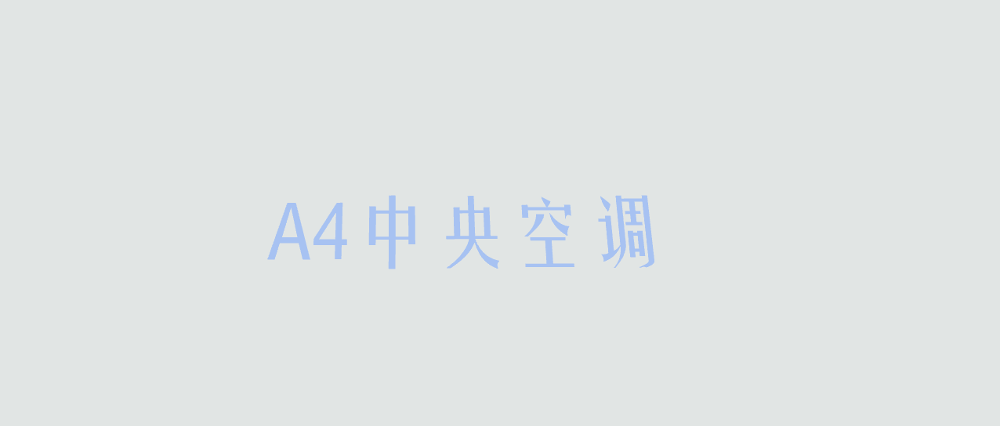

# 初始化模型视角

封装生成文本标签的方法，用于在模型上显示文字，支持批量生成标签

```js
/**
 * 创建文本标签
 * @param {Array} textData - 文本数据，包含要显示的文本、位置和旋转信息
 * @param {number} color - 文本的颜色
 */
function createTextTips(textData, color) {
  const loader = new FontLoader();
  loader.load('static/fonts/FZYaoTi_Regular.json', function (font) {
    const textObj = new THREE.Object3D();
    const material = new THREE.MeshBasicMaterial({ color: color });

    textData.forEach(item => {
      console.log(item);

      // 创建文本几何体
      const geometry = new TextGeometry(item.text, {
        font: font,
        size: 1,
        height: 0.01,
        curveSegments: 12,
        bevelEnabled: false,
        bevelThickness: 10,
        bevelSize: 8,
        bevelOffset: 0,
        bevelSegments: 3,
      });

      // 创建文本网格
      const mesh = new THREE.Mesh(geometry, material);
      mesh.rotation.set(...item.rotation);
      mesh.position.set(item.position.x, item.position.y, item.position.z);

      // 将文本网格添加到文本对象中
      textObj.add(mesh);
    });

    // 将文本对象添加到场景中
    scene.add(textObj);
  });
}

// 使用方法
createTextTips(
	[
		{
			text:'A4中央空调',
			position:{
				x:0,
				y:0,
				z:0
			},
			rotation:[-Math.PI/2,0,Math.PI/2]
		}
	],
	0x6289e3,
);
```

得到的效果如下：

本文参考 [https://threejs.org/docs/index.html?q=FONT#examples/zh/loaders/FontLoader]()
