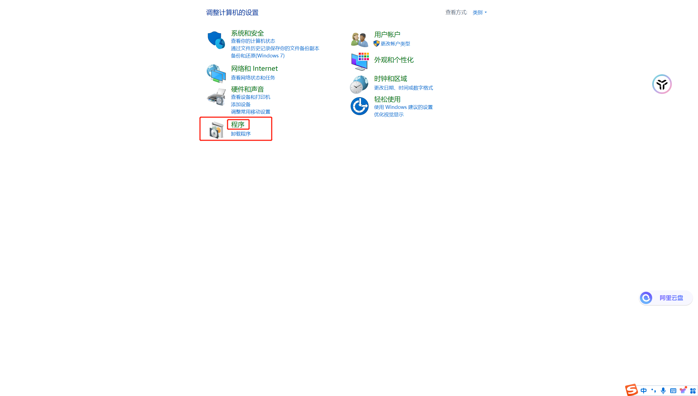
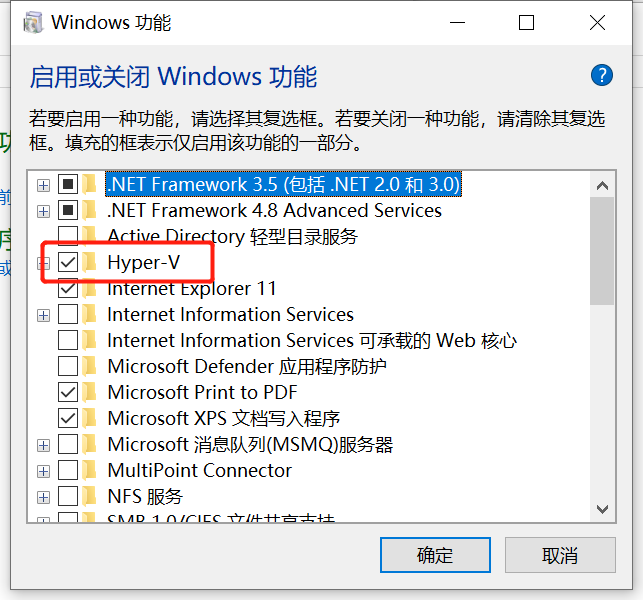
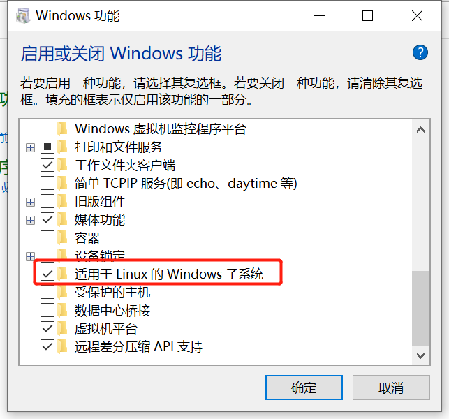
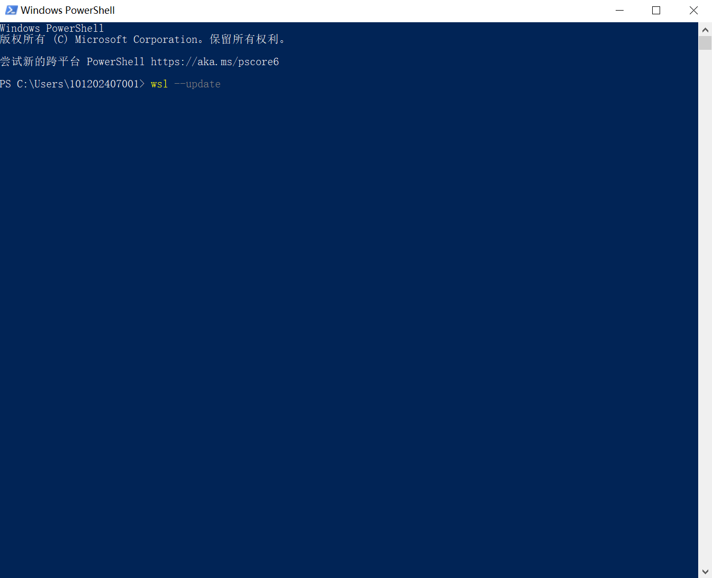

# 在windows上docker运行流程文档.md

1、下载docker
官方网站下载https://www.docker.com/
下载完成后按照流程正常安装
2、进入控制面板，找到程序中启动或关闭Windows功能，确认Hyper-v与适用Linux的Windows子系统勾选上

3、打开cmd控制台或PowerShell 执行 wsl --update 指令

4、重启电脑，打开Docker Desktop 即可运行docker。
