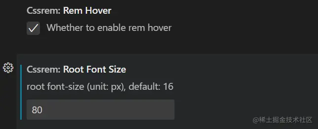
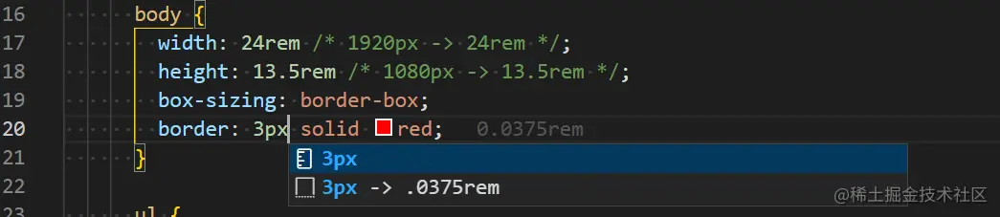
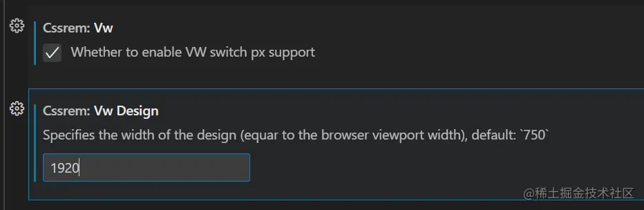
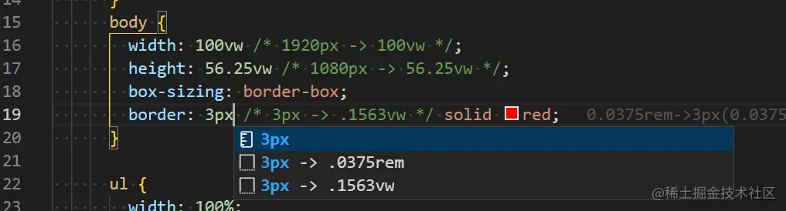

# 1\. 适配方案1：rem + font-size

我们都知道，在 `css` 中 `1rem` 等于 `html` 根元素设定的 `font-size` 的 `px` 值，通过动态的修改 `html` 根元素的 `font-size` 大小就能动态的改变 `rem` 的大小，从而实现适配。

**原理**

1. 动态设置 `HTML` 根字体大小
2. 将 `px` 转成 `rem`

**实现**

1. 引入 [lib-flexible](https://github.com/amfe/lib-flexible/blob/2.0/index.js "https://github.com/amfe/lib-flexible/blob/2.0/index.js") 动态设置 `HTML` 根字体大小和 `body` 字体大小。

```js
(function flexible(window, document) {
  var docEl = document.documentElement;
  var dpr = window.devicePixelRatio || 1;

  // 调整 body 字体大小
  function setBodyFontSize() {
    if (document.body) {
      // body 字体大小默认为 16px
      document.body.style.fontSize = 16 * dpr + "px";
    } else {
      document.addEventListener("DOMContentLoaded", setBodyFontSize);
    }
  }
  setBodyFontSize();

  // 移动端默认平均分成 10 等分(适用移动端)
  // pc端默认平均分成 24 等分（适用 pc 端）
  function setRemUnit() {
    var splitNum = /Mobi|Android|iPhone/i.test(navigator.userAgent) ? 10 : 24;
    var rem = docEl.clientWidth / splitNum; // 1920 / 24 = 80
    docEl.style.fontSize = rem + "px"; // 设置 html 字体的大小 80px
  }

  setRemUnit();

  // 页面调整大小时重置 rem 单位
  window.addEventListener("resize", setRemUnit);
  window.addEventListener("pageshow", function (e) {
    if (e.persisted) {
      setRemUnit();
    }
  });

  // 检测 0.5px 支持
  if (dpr >= 2) {
    var fakeBody = document.createElement("body");
    var testElement = document.createElement("div");
    testElement.style.border = ".5px solid transparent";
    fakeBody.appendChild(testElement);
    docEl.appendChild(fakeBody);
    if (testElement.offsetHeight === 1) {
      docEl.classList.add("hairlines");
    }
    docEl.removeChild(fakeBody);
  }
})(window, document);
```

2. 将 `px` 转 `rem`

   `px` 转 `rem` 的方式有很多种：手动、`less/scss` 函数、`cssrem` 插件、`webpack` 插件、\*\*`Vite` 插件。

- **`cssrem` 插件转换**

  vscode `root font-size` 设置为 80px。这个是 `px` 单位转 `rem` 的参考值。

  

  接着就可以按照 1920px \* 1080px 的设计稿愉快开发，此时页面已经是响应式，并且宽高比不变

  
- **`webpack` 插件转换**

  安装

  ```shell
  npm i webpack webpack-cli -D
  npm i style-loader css-loader html-webpack-plugin -D
  npm i postcss-pxtorem autoprefixer postcss-loader postcss -D
  ```

  配置 `webpack.config.js`

  ```js
  const HtmlWebpackPlugin = require("html-webpack-plugin");
  const path = require("path");

  module.exports = {
    entry: "./src/index.js",
    mode: "development",
    output: {
      filename: "[name].[contenthash].bundle.js",
      path: path.resolve("./dist"),
    },
    module: {
      rules: [
        {
          test: /\.css$/i,
          use: ["style-loader", "css-loader", "postcss-loader"],
        },
      ],
    },
    plugins: [
      new HtmlWebpackPlugin({
        template: "./index.html",
      }),
    ],
  };

  ```

  配置 `postcss.config.js` 文件，`postcss-pxtorem 的配置` 可以查询 [文档](https://github.com/cuth/postcss-pxtorem "https://github.com/cuth/postcss-pxtorem")

  ```js
  module.exports = {
    plugins: {
      autoprefixer: {},
      "postcss-pxtorem": {
        rootValue: 80, // 根元素的字体大小
        unitPrecision: 5, // 小数点后精度
        propList: ["*"], // 可以从px改变为rem的属性
        exclude: /node_modules/i, // 要忽略并保留为px的文件路径
        minPixelValue: 0, // 最小的px转化值（小于这个值的不转化）
        mediaQuery: false, //  允许在媒体查询中转换px
        selectorBlackList: [], // 要忽略并保留为px的选择器
        replace: true, // 直接在css规则上替换值而不是添加备用
      },
    },
  };
  ```

  在 `main.js` 中引入 `lib_flexible.js` `index.js` `index.css` ，最后重启项目即可。

> 这里我为了回顾一下 `webpack` 配置，就从 0 开始配置了。一般通过脚手架创建的项目会有集成webpack以及postcss的，只需要 安装一下 `postcss postcss-pxtorem` 与配置 `postcss.config.js` 即可

> 由于 `viewport` 单位得到众多浏览器的兼容，`lib-flexible` 这个过渡方案已经可以放弃使用，不管是现在的版本还是以前的版本，都存有一定的问题。下面就将介绍 `viewport` 的方案。

# 2\. 适配方案2：vw 单位

直接使用 `vw` 单位。

屏幕的宽默认为 100vw，那么100vw = 1920px， 1vw = 19.2px 。

**实现**

将 `px` 转 `vw`

- **`cssrem` 插件方式转换**

  

  接着就可以按照 1920px \* 1080px 的设计稿愉快开发，此时的页面已经是响应式，并宽高比不变

  
- **`webpack` 插件转换**

**安装**

```shell
npm i webpack webpack-cli -D
npm i style-loader css-loader html-webpack-plugin -D
npm i postcss-px-to-viewport autoprefixer postcss-loader postcss -D
```

`webpack.config.js` 配置不变

配置 `postcss.config.js`

```js
module.exports = {
  plugins: {
    '@our-patches/postcss-px-to-viewport': {
      unitToConvert: 'px', // 要转化的单位
      viewportWidth: 1920, // UI设计稿的宽度
      unitPrecision: 6, // 转换后的精度，即小数点位数
      propList: ['*'], // 指定转换的css属性的单位，*代表全部css属性的单位都进行转换
      viewportUnit: 'vw', // 指定需要转换成的视窗单位，默认vw
      fontViewportUnit: 'vw', // 指定字体需要转换成的视窗单位，默认vw
      selectorBlackList: [], // 指定不转换为视窗单位的类名，
      minPixelValue: 1, // 默认值1，小于或等于1px则不进行转换
      mediaQuery: true, // 是否在媒体查询的css代码中也进行转换，默认false
      replace: true, // 是否转换后直接更换属性值
      include: /\/src\/views\/pc\/layoutMapBS\//,
      exclude: [/node_modules/], // 设置忽略文件，用正则做目录名匹配
      landscape: false // 是否处理横屏情况
    }
  }
}
```

:::warning{title="注意"} `postcss-pxtoviewport` 这个插件在文档中有 `include` 这个选项，但是作者一直没更新代码，导致这个选项一直无效，而且作者已经很久没改了。可以使用 `@our-patches/postcss-px-to-viewport`。

**安装**

```shell
npm i @our-patches/postcss-px-to-viewport -D
```

**配置** 只需要在 `postcss.config.js` 中将 `postcss-px-to-viewport` 改为 `postcss-px-to-viewport` 即可 :::

# 3\. 适配方案3：scale（推荐）

使用CSS3中的scale函数来缩放网页，这里我们将使用两种方案来实现：

1. **方案一：直接根据宽度的比率进行缩放。（宽度比率=网页当前宽 / 设计稿宽）**

```JS
<script>
window.onload = function () {
  triggerScale();
  window.addEventListener("resize", function () {
    triggerScale();
  });
};

function triggerScale() {
  var targetX = 1920;
  var targetY = 1080;

  // 获取html的宽度和高度（不包含滚动条）
  var currentX =
    document.documentElement.clientWidth || document.body.clientWidth;
  // https://developer.mozilla.org/en-US/docs/Web/API/Element/clientWidth
  var currentY =
    document.documentElement.clientHeight || document.body.clientHeight;

  // 1.缩放比例  3840 / 2160 => 2
  var ratio = currentX / targetX;

  var bodyEl = document.querySelector("body");
  // 2.需要修改缩放的原点 body { transform-origin: left top; }
  bodyEl.setAttribute("style", `transform:scale(${ratio})`);
}
</script>
```

2. **方案二：动态计算网页宽高比，决定是是否按照宽度的比率进行缩放。**

```html
<script>
window.onload = function () {
  triggerScale();
  window.addEventListener("resize", function () {
    triggerScale();
  });
};

function triggerScale() {
  var targetX = 1920;
  var targetY = 1080;
  var targetRatio = 16 / 9;
  var currentX =
    document.documentElement.clientWidth || document.body.clientWidth;
  var currentY =
    document.documentElement.clientHeight || document.body.clientHeight;

  // 1.缩放比例  3840 / 2160 => 2
  var ratio = currentX / targetX;
  var currentRatio = currentX / currentY;
  var transformStr = "";
  if (currentRatio > targetRatio) {
    ratio = currentY / targetY;
    transformStr = `transform:scale(${ratio}) translateX(-${
      targetX / 2
    }px); left:50%;`;
  } else {
    transformStr = `transform:scale(${ratio})`;
  }
  var bodyEl = document.querySelector("body");
  // 2.需要修改缩放的原点 body { transform-origin: left top; }
  bodyEl.setAttribute("style", transformStr);
}
</script>
```

**3\. Vue3 hooks封装 useScalePage**

```js
import { onMounted, onUnmounted } from 'vue';
import _ from 'lodash' 

/**
  大屏适配的 hooks
 */
export default function useScalePage(option) {

  const resizeFunc = _.throttle(function() {
    triggerScale() // 动画缩放网页
  }, 100)

  onMounted(()=>{
    triggerScale()  // 动画缩放网页
    window.addEventListener('resize', resizeFunc)
  })

  onUnmounted(()=>{
    window.removeEventListener('resize', resizeFunc) // 释放
  })

  // 大屏的适配
  function triggerScale() {
    // 1.设计稿的尺寸
    let targetX = option.targetX ||  1920
    let targetY = option.targetY || 1080
    let targetRatio = option.targetRatio ||  16 / 9 // 宽高比率

    // 2.拿到当前设备(浏览器)的宽度
    let currentX = document.documentElement.clientWidth || document.body.clientWidth
    let currentY = document.documentElement.clientHeight || document.body.clientHeight

    // 3.计算缩放比例
    let scaleRatio = currentX / targetX; // 参照宽度进行缩放 ( 默认情况 )
    let currentRatio = currentX / currentY // 宽高比率

    // 超宽屏
    if(currentRatio > targetRatio) {
      // 4.开始缩放网页
      scaleRatio = currentY / targetY // 参照高度进行缩放
      document.body.style = `width:${targetX}px; height:${targetY}px;transform: scale(${scaleRatio}) translateX(-50%); left: 50%`
    } else {
      // 4.开始缩放网页
      document.body.style = `width:${targetX}px; height:${targetY}px; transform: scale(${scaleRatio})`
    }
  }
}
```

# 4\. 总结

**三种适配方案的对比**

- **`vw` 相比于 `rem` 的优势**：
  - **优势一**：不需要去**计算 `html` 的 `font-size` 大小**，不需要给 `html` 设置 `font-size`，也不需要**设置 `body` 的 `font-size`** ，防止继承；
  - **优势二**：因为不依赖 `font-size` 的尺寸，所以不用担心某些原因 `html` 的 `font-size` 尺寸被篡改，页面尺寸混乱；
  - **优势三**：**`vw` 相比于 `rem` 更加语义化**，`1vw` 是 `1/100` 的 `viewport` 大小（即将屏幕分成 `100` 份）; **并且具备 `rem` 之前所有的优点**；
- **`vw` 和 `rem` 存在问题**
  - 如果使用 `rem` 或 `vw` 单位时，在 `JS` 中添加样式时，**单位需要手动设置 `rem` 或 `vw`** 。
  - **第三方库的字体等默认的都是 `px` 单位**，比如：`element`、`echarts`，因此通常需要层叠第三方库的样式。
  - 当大屏比例更大时，有些**字体还需要相应的调整字号**。
- **`scale` 相比 `vw` 和 `rem` 的优势**
  - **优势一**：相比于 `vw` 和 `rem`，使用起来更加简单，不需要对单位进行转换。
  - **优势二**：因为不需要对单位进行转换，在使用第三方库时，不需要考虑单位转换问题。
  - **优势三**：由于浏览器的字体默认最小是不能小于 `12px` ，导致 `rem` 或 `vw` 无法设置小于 `12` px的字体，缩放没有这个问题。
