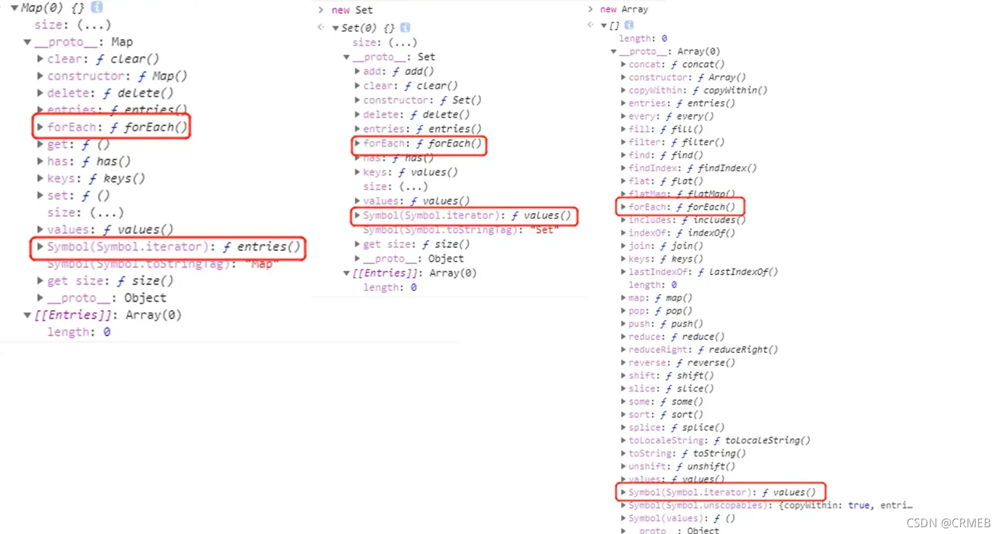
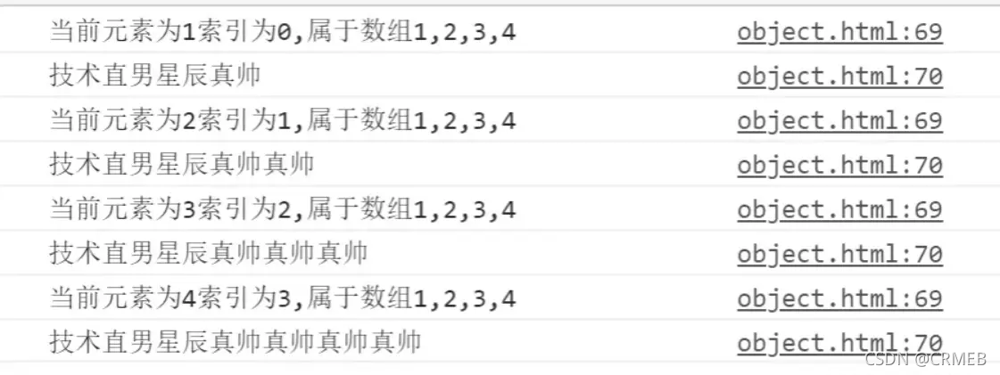

js中那么多循环，for for…in for…of [forEach](https://so.csdn.net/so/search?q=forEach&spm=1001.2101.3001.7020)，有些循环感觉上是大同小异今天我们讨论下for循环和forEach的差异。
我们从几个维度展开讨论：

for循环和forEach的本质区别。
for循环和forEach的语法区别。
for循环和forEach的性能区别。
本质区别
for循环是js提出时就有的循环方法。forEach是ES5提出的，挂载在可迭代对象原型上的方法，例如Array Set Map。
forEach是一个迭代器，负责遍历可迭代对象。那么遍历，迭代，可迭代对象分别是什么呢。
遍历：指的对数据结构的每一个成员进行有规律的且为一次访问的行为。
迭代：迭代是递归的一种特殊形式，是迭代器提供的一种方法，默认情况下是按照一定顺序逐个访问数据结构成员。迭代也是一种遍历行为。
可迭代对象：ES6中引入了 iterable 类型，Array Set Map String arguments NodeList 都属于 iterable，他们特点就是都拥有 \[Symbol.iterator\] 方法，包含他的对象被认为是可迭代的 iterable。



在了解这些后就知道 forEach 其实是一个迭代器，他与 for 循环本质上的区别是 forEach 是负责遍历（Array Set Map）可迭代对象的，而 for 循环是一种循环机制，只是能通过它遍历出数组。
再来聊聊究竟什么是迭代器，还记得之前提到的 Generator 生成器，当它被调用时就会生成一个迭代器对象（Iterator Object），它有一个 .next()方法，每次调用返回一个对象{value:value,done:Boolean}，value返回的是 yield 后的返回值，当 yield 结束，done 变为 true，通过不断调用并依次的迭代访问内部的值。
迭代器是一种特殊对象。ES6规范中它的标志是返回对象的 next() 方法，迭代行为判断在 done 之中。在不暴露内部表示的情况下，迭代器实现了遍历。看代码

```auto
let arr = [1, 2, 3, 4]  // 可迭代对象
let iterator = arr[Symbol.iterator]()  // 调用 Symbol.iterator 后生成了迭代器对象
console.log(iterator.next()); // {value: 1, done: false}  访问迭代器对象的next方法
console.log(iterator.next()); // {value: 2, done: false}
console.log(iterator.next()); // {value: 3, done: false}
console.log(iterator.next()); // {value: 4, done: false}
console.log(iterator.next()); // {value: undefined, done: true}
```

我们看到了。只要是可迭代对象，调用内部的 Symbol.iterator 都会提供一个迭代器，并根据迭代器返回的next 方法来访问内部，这也是 for…of 的实现原理。

```auto
let arr = [1, 2, 3, 4]
for (const item of arr) {
    console.log(item); // 1 2 3 4 
}
```

把调用 next 方法返回对象的 value 值并保存在 item 中，直到 value 为 undefined 跳出循环，所有可迭代对象可供for…of消费。 再来看看其他可迭代对象：

```auto
function num(params) {
    console.log(arguments); // Arguments(6) [1, 2, 3, 4, callee: ƒ, Symbol(Symbol.iterator): ƒ]
    let iterator = arguments[Symbol.iterator]()
    console.log(iterator.next()); // {value: 1, done: false}
    console.log(iterator.next()); // {value: 2, done: false}
    console.log(iterator.next()); // {value: 3, done: false}
    console.log(iterator.next()); // {value: 4, done: false}
    console.log(iterator.next()); // {value: undefined, done: true}
}
num(1, 2, 3, 4)

let set = new Set('1234')
set.forEach(item => {
    console.log(item); // 1 2 3 4
})
let iterator = set[Symbol.iterator]()
console.log(iterator.next()); // {value: 1, done: false}
console.log(iterator.next()); // {value: 2, done: false}
console.log(iterator.next()); // {value: 3, done: false}
console.log(iterator.next()); // {value: 4, done: false}
console.log(iterator.next()); // {value: undefined, done: true}
```

所以我们也能很直观的看到可迭代对象中的 Symbol.iterator 属性被调用时都能生成迭代器，而 forEach 也是生成一个迭代器，在内部的回调函数中传递出每个元素的值。
（感兴趣的同学可以搜下 forEach 源码， Array Set Map 实例上都挂载着 forEach ，但网上的答案大多数是通过 length 判断长度， 利用for循环机制实现的。但在 Set Map 上使用会报错，所以我认为是调用的迭代器，不断调用 next，传参到回调函数。由于网上没查到答案也不妄下断言了，有答案的人可以评论区给我留言）

for循环和forEach的语法区别
了解了本质区别，在应用过程中，他们到底有什么语法区别呢？

forEach 的参数。
forEach 的中断。
forEach 删除自身元素，index不可被重置。
for 循环可以控制循环起点。
forEach 的参数
我们真正了解 forEach 的完整传参内容吗？它大概是这样：

```auto
arr.forEach((self,index,arr) =>{},this)
```

self： 数组当前遍历的元素，默认从左往右依次获取数组元素。
index： 数组当前元素的索引，第一个元素索引为0，依次类推。
arr： 当前遍历的数组。
this： 回调函数中this指向。

```auto
let arr = [1, 2, 3, 4];
let person = {
    name: '技术直男星辰'
};
arr.forEach(function (self, index, arr) {
    console.log(`当前元素为${self}索引为${index},属于数组${arr}`);
    console.log(this.name+='真帅');
}, person)
```

我们可以利用 arr 实现数组去重：

```auto
let arr1 = [1, 2, 1, 3, 1];
let arr2 = [];
arr1.forEach(function (self, index, arr) {
    arr.indexOf(self) === index ? arr2.push(self) : null;
});
console.log(arr2);   // [1,2,3]

复制代码
12345678
```



forEach 的中断
在js中有break return continue 对函数进行中断或跳出循环的操作，我们在 for循环中会用到一些中断行为，对于优化数组遍历查找是很好的，但由于forEach属于迭代器，只能按序依次遍历完成，所以不支持上述的中断行为。

```auto
let arr = [1, 2, 3, 4],
    i = 0,
    length = arr.length;
for (; i < length; i++) {
    console.log(arr[i]); //1,2
    if (arr[i] === 2) {
        break;
    };
};

arr.forEach((self,index) => {
    console.log(self);
    if (self === 2) {
        break; //报错
    };
});

arr.forEach((self,index) => {
    console.log(self);
    if (self === 2) {
        continue; //报错
    };
});
```

如果我一定要在 forEach 中跳出循环呢？其实是有办法的，借助try/catch：

```auto
try {
    var arr = [1, 2, 3, 4];
    arr.forEach(function (item, index) {
        //跳出条件
        if (item === 3) {
            throw new Error("LoopTerminates");
        }
        //do something
        console.log(item);
    });
} catch (e) {
    if (e.message !== "LoopTerminates") throw e;
};
```

若遇到 return 并不会报错，但是不会生效

```auto
let arr = [1, 2, 3, 4];

function find(array, num) {
    array.forEach((self, index) => {
        if (self === num) {
            return index;
        };
    });
};
let index = find(arr, 2);// undefined
```

forEach 删除自身元素，index不可被重置
在 forEach 中我们无法控制 index 的值，它只会无脑的自增直至大于数组的 length 跳出循环。所以也无法删除自身进行index重置，先看一个简单例子：

```auto
let arr = [1,2,3,4]
arr.forEach((item, index) => {
    console.log(item); // 1 2 3 4
    index++;
});
```

index不会随着函数体内部对它的增减而发生变化。在实际开发中，遍历数组同时删除某项的操作十分常见，在使用forEach删除时要注意。

for 循环可以控制循环起点
如上文提到的 forEach 的循环起点只能为0不能进行人为干预，而for循环不同：

```auto
let arr = [1, 2, 3, 4],
    i = 1,
    length = arr.length;

for (; i < length; i++) {
    console.log(arr[i]) // 2 3 4
};
```

那之前的数组遍历并删除滋生的操作就可以写成

```auto
let arr = [1, 2, 1],
    i = 0,
    length = arr.length;

for (; i < length; i++) {
    // 删除数组中所有的1
    if (arr[i] === 1) {
        arr.splice(i, 1);
        //重置i，否则i会跳一位
        i--;
    };
};
console.log(arr); // [2]
//等价于
var arr1 = arr.filter(index => index !== 1);
console.log(arr1) // [2]
```

for循环和forEach的性能区别
在性能对比方面我们加入一个 map 迭代器，它与 filter 一样都是生成新数组。我们对比 for forEach map 的性能在浏览器环境中都是什么样的：
性能比较：for > forEach > map
在chrome 62 和 Node.js v9.1.0环境下：for 循环比 forEach 快1倍，forEach 比 map 快20%左右。 原因分析
for：for循环没有额外的函数调用栈和上下文，所以它的实现最为简单。
forEach：对于forEach来说，它的函数签名中包含了参数和上下文，所以性能会低于 for 循环。
map：map 最慢的原因是因为 map 会返回一个新的数组，数组的创建和赋值会导致分配内存空间，因此会带来较大的性能开销。如果将map嵌套在一个循环中，便会带来更多不必要的内存消耗。
当大家使用迭代器遍历一个数组时，如果不需要返回一个新数组却使用 map 是违背设计初衷的。在我前端合作开发时见过很多人只是为了遍历数组而用 map 的：

```auto
let data = [];
let data2 = [1,2,3];
data2.map(item=>data.push(item));
```

写在最后：这是我面试遇到的一个问题，当时只知道语法区别。并没有从可迭代对象，迭代器，生成器和性能方面，多角度进一步区分两者的异同，我也希望我能把一个简单的问题从多角度展开细讲，让大家正在搞懂搞透彻。
