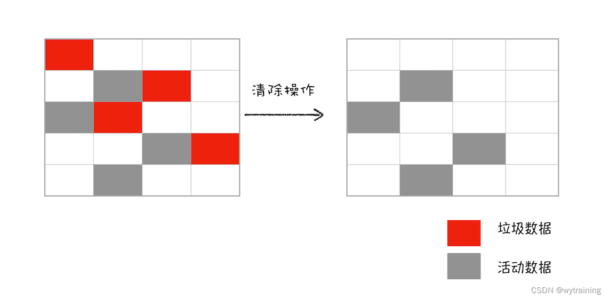
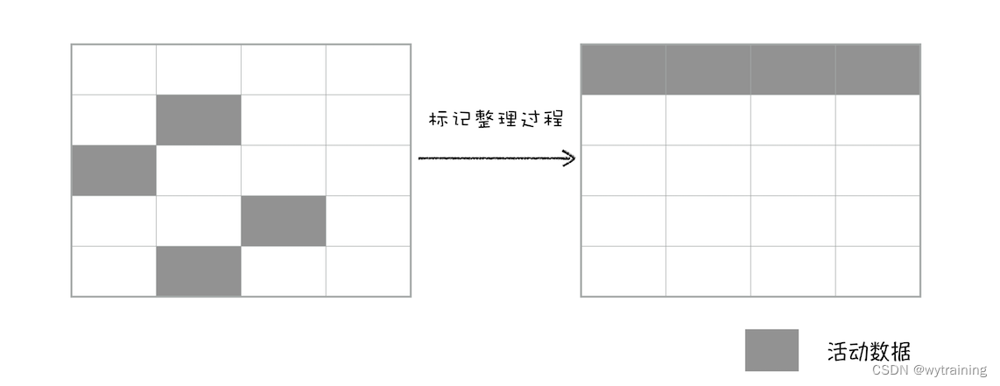

# 浏览器的垃圾回收机制

### 一：堆和栈

**1\. 数据的存储方式**
栈内存：线性有序存储，容量小，系统分配效率高。（存放原始类型）
[堆内存](https://so.csdn.net/so/search?q=%E5%A0%86%E5%86%85%E5%AD%98&spm=1001.2101.3001.7020)：首先要在堆内存新分配存储区域，之后又要把指针存储到栈内存中，效率相对就要低一些了。 （存放引用类型的值）

**2\. 为什么一定要分“堆”和“栈”两个存储空间呢？所有数据直接存放在“栈”中不就可以了吗？**
不可以的。这是因为JavaScript 引擎需要用栈来维护程序执行期间上下文的状态，如果栈空间大了话，所有的数据都存放在栈空间里面，那么会影响到上下文切换的效率，进而又影响到整个程序的执行效率。

**3\. 垃圾回收器**
因为数据是存储在栈和堆两种内存空间中的，所以浏览器的[垃圾回收机制](https://so.csdn.net/so/search?q=%E5%9E%83%E5%9C%BE%E5%9B%9E%E6%94%B6%E6%9C%BA%E5%88%B6&spm=1001.2101.3001.7020)根据数据的存储方式分为 “**栈垃圾回收**” 和 “**堆垃圾回收**”。

### 二：栈垃圾回收

当一个函数执行结束之后，JS引擎通过向下移动ESP指针（记录调用栈当前执行状态的指针），来销毁该函数保存在栈中的执行上下文（变量环境、词法环境、this、outer），遵循先进后出的原则。

### 三：堆垃圾回收

当函数执行结束，栈空间处理完成了，但是堆空间的数据虽然没有被引用，但还是存储在堆空间中，需要[垃圾回收器](https://so.csdn.net/so/search?q=%E5%9E%83%E5%9C%BE%E5%9B%9E%E6%94%B6%E5%99%A8&spm=1001.2101.3001.7020)将堆空间中的垃圾数据回收。

简单介绍两个最常见的垃圾回收：**`标记清除算法`** 和 **`引用计数算法`**

### 1.标记清除（常用）

就像它的名字一样，此算法分为 **`标记`** 和 **`清除`** 两个阶段，标记阶段即为所有活动对象做上标记，清除阶段则把没有标记（也就是非活动对象）销毁

1. 垃圾收集器在运行时会给内存中的所有变量都加上一个标记
2. 然后从各个根对象开始遍历，把还在被上下文变量引用的变量标记去掉标记
3. 清理所有带有标牌机的变量，销毁并回收它们所占用的内存空间
4. 最后垃圾回收程序做一次内存清理

使用标记清除策略的最重要的优点在于简单，无非是标记和不标记的差异。通过标记清除之后，剩余的对象内存位置是不变的，也会导致空闲内存空间是不连续的，这就造成出现内存碎片的问题。内存碎片多了后，如果要存储一个新的需要占据较大内存空间的对象，就会造成影响。对于通过标记清除产生的内存碎片，还是需要通过标记整理策略进行解决。【缺点：内存碎片化、分配速度慢】

### 2.标记整理

标记整理：可以有效地解决标记清除的两个缺点。它的标记阶段和标记清除算法没有什么不同，只是标记结束后，标记整理算法会将活着的对象（即不需要清理的对象）向内存的一端移动，最后清理掉边界的内存。

### 3.引用计次

引用计次： 当对象被引用的次数为零时进行回收，但是循环引用时，两个对象都至少被引用了一次，因此导致内存泄漏（垃圾：一般来说没有被引用的对象就是垃圾，就是要被清除， 有个例外如果几个对象引用形成一个环，互相引用，但根访问不到它们，这几个对象也是垃圾，也要被清除。）

### 四：V8对于垃圾回收机制的优化

大多数浏览器都是基于标记清除算法，不同的只是在运行垃圾回收的频率具有差异。V8 对其进行了一些优化加工处理，那接下来我们主要就来看 V8 中对垃圾回收机制的优化。

### 1.分代式垃圾回收

V8 的垃圾回收策略主要基于分代式垃圾回收机制，V8 中将堆内存分为新生代和老生代两区域，采用不同的垃圾回收器也就是不同的策略管理垃圾回收。（V8 整个堆内存的大小就等于新生代加上老生代的内存）

- `新生代：`新生代的对象为存活时间较短的对象，简单来说就是新产生的对象，通常只支持 1～8M 的容量
- `老生代：`老生代的对象为存活事件较长或常驻内存的对象，简单来说就是经历过新生代垃圾回收后还存活下来的对象，容量通常比较大

### 2.新生代内存回收

对于新生代内存的回收，通常是通过 Scavenge 的算法进行垃圾回收，就是将新生代内存进行一分为二，正在被使用的内存空间称为使用区，而限制状态的内存空间称为空闲区。

1. 新加入的对象都会存放在使用区，当使用区快写满时就进行一次垃圾清理操作。
2. 在开始进行垃圾回收时，新生代回收器会对使用区内的对象进行标记
3. 标记完成后，需要对使用区内的活动对象拷贝到空闲区进行排序
4. 而后进入垃圾清理阶段，将非活动对象占用的内存空间进行清理
5. 最后对使用区和空闲区进行交换，使用区->空闲区，空闲区->使用区

**`对象晋升策略：`** 新生代中的变量如果经过回收之后依然一直存在，那么会放入到老生代内存中，只要是已经经历过一次Scavenge算法回收的，就可以晋升为老生代内存的对象。

### 3.老生代内存回收

相比于新生代，老生代的垃圾回收就比较容易理解了，上面我们说过，对于大多数占用空间大、存活时间长的对象会被分配到老生代里，因为老生代中的对象通常比较大，如果再如新生代一般分区然后复制来复制去就会非常耗时，从而导致回收执行效率不高，所以老生代垃圾回收器来管理其垃圾回收执行，它的整个流程就采用的就是上文所说的 `标记清除算法`了

前面我们也提过，标记清除算法在清除后会产生大量不连续的内存碎片，过多的碎片会导致大对象无法分配到足够的连续内存，而 V8 中就采用了我们上文中说的 `标记整理算法`来解决这一问题来优化空间

### 4.全停顿

现在你知道了 V8 是使用副垃圾回收器和主垃圾回收器处理垃圾回收的，不过由于 JavaScript 是运行在主线程之上的，一旦执行垃圾回收算法，都需要将正在执行的 JavaScript 脚本暂停下来，待垃圾回收完毕后再恢复脚本执行。我们把这种行为叫做全停顿。

为了降低老生代的垃圾回收而造成的卡顿，V8 将标记过程分为一个个的子标记过程，同时让垃圾回收标记和 JavaScript 应用逻辑交替进行，直到标记阶段完成，我们把这个算法称为 `增量标记算法`。如下图所示：

使用增量标记算法，可以把一个完整的垃圾回收任务拆分为很多小的任务，这些小的任务执行时间比较短，可以穿插在其他的 JavaScript 任务中间执行，这样当执行上述动画效果时，就不会让用户因为垃圾回收任务而感受到页面的卡顿了。

[「硬核JS」你真的了解垃圾回收机制吗](https://juejin.cn/post/6981588276356317214#heading-7)
[Javascript的垃圾回收机制知多少？](https://juejin.cn/post/7038593947995734030#heading-3)

### 五：内存泄漏

对于持续运行的服务进程，必须及时释放内存，否则，内存占用越来越高，轻则影响系统性能，重则导致进程崩溃。

不再用到的内存，没有及时释放，就叫做内存泄漏。
